# Load Balance Algorithms

我的LB算法分享文档里写了很多种一致性哈希算法，现在需要把它们放在一起实现并进行对比。
1. 实现各个一致性哈希算法
2. 进行实验测试算法
3. 对结果进行汇总并绘制对比图像
我实验想要知道的是：
1. 各个算法的峰均值比
2. 各个算法在添加了不同的后端服务器数量之后，新添加连接时进行调度的时间
3. 各个算法在已有1000台后端服务器数量的情况下，增加和删除不同数量的后端服务器会造成多少key重映射

> 写在最前：LB 算法的更新是一直在考虑如何才算是公平性的问题。它想讨论的是在不同层面（角度）的公平性和不同场景下的公平性，例如当你考虑到从 LB 还是后端服务器的角度考虑问题，亦或是不同服务器之间的性能差异、连接状态的差异，又或是在后端的扩缩容场景、跨不同地域场景？等
>
> 应该说 LB 算法之间没有绝对的好坏之分，而是根据场景需求选择最合适的方法
>
> 比较好的方式是评估哪台服务器有能力继续及时的处理请求，我们可以通过一些方式或指标来评判谁当前更有能力或更能及时的进行处理，将下一个新连接交给它。怎么判断谁现在更有能力或更能及时处理呢？
>
> * 当前 CPU 负载
> * 已有的连接数量
> * 网络连接空闲
> * [发散] 服务器主动提出想要接收 (或任务窃取)

## 基础公平（雨露均沾）

* RR (Round Robin，轮询)

按照所有 rs 组成的队列，遍历的选择下一个还未调度的 RS，保证了最基础的调度公平但不考虑任何可能的差异

## 从服务器间存在差异的角度

后端服务器本身在处理时必定有一些性能差异。相比于收集 RS 还有多少任务要处理，或是持续统计所有 RS 的 CPU 占用率，肯定是直接由 RS 性能来定义权重最为简单高效

权重需要动态可调。对业务来说，新上线的 RS 可以自行动态的由低到高的缓慢修改其权重来实现预热等一些需求，或是新增 RS 的权重相应拉高来保证它在开始时有更多的任务去处理来快速分担其他 RS 的压力等

### (I)WRR

对每个 RS 都相应的配置其权重，优先选择当前权重最高的 RS 进行调度

* WRR (Weighted Round Robin，加权轮询)

传统的 WRR 是以队列的层面看待，相当于为每个 RS 开辟一个发送队列，批量的将与权重数量相当的包直接转发给选择的 RS。它的好处也是可以批量处理，但是这对 LB 来说没有必要

简单的改进是以单个数据包的层面进行划分。对每个数据包来说选择当前权重最大的 RS 进行转发并更新其当前权重 

* IWRR (Interleaved WRR，交错的加权轮询)

IWRR 尽量强调了轮询的处理，保证调度初期是以轮询的方式选择，直到其当前权重到 0 就直接跳过

**问题：**权重差

1. WRR 的权重配置中如果出现相差较多的权重差，就会导致某一段时间里做出**连续相同**的调度选择。这对 LB 来说是比较致命的，从 RS 的角度考虑，这一台较高会在短时间内打入大量的新连接 -> **平滑**处理，打散高权重的连续调度
2. 一整轮**调度中间的权重更新**会导致重新开始的调度，从更长的时间线上看会加剧连续调度的问题 -> **权重延迟更新**，只更新 RS 权重但不修改当前权重值，会使得新权重在下一轮才会被感知到

### SWRR

* SWRR (Smooth Weighted Round Robin，平滑加权轮询)

为了能打散高权重的连续调度，希望能有一种方法把连续调度尽可能平滑的插入到别的位置里

预先计算总权重

对于每一次选择：

1. 选择当前权重最高的 RS 调度
2. 选择的 RS 当前权重减去总权重，加速抹平权重间的差值
3. 为了保证当权权重之和仍然等于总权重，为每个 RS 的当前权重增加其定义的权重

**问题：**调度时间开销和相同调度选择

1. 每次调度需要遍历所有的 RS 找到当前权重最大的一个，查找调度**时间开销**为 O(N) 或 O(logN)（如果选择用例如最小堆维护，就需要额外花时间维护堆），更新当前权重 O(N) -> **预先计算**调度顺序，调度时可以直接 O(1) 选择
2. **集群**中每一个单机和单机中每一个 WORKER 都会做出相同的调度选择，使得从整体上来看（或从 RS 的角度看）LB 会做出多次连续重复的调度 -> 调度顺序**随机**初始位置
3. 其他优化方案参见 Nginx 章节

### VNSWRR

* VNSWRR (Virtual Node Smooth Weighted Round Robin，虚拟节点平滑加权轮询)

对于 SWRR，预先计算好完整的调度顺序表，并在一开始选择随机的 idx 开始调度，从而打散刚启动时集群整体的连续相同调度

**Step + Unordered List 优化**

预先计算完整的调度顺序表在 RS 数量较多的时候会消耗较长的时间，而这段时间被认为是无法开始调度的

通过分 Step 计算来压缩一开始计算调度顺序表的时间，直到后续调度需要时再计算下一个 Step 的调度顺序，直到计算完完整的调度顺序表。但是这就导致随机 idx 只能在一个 Step 的范围内选择

打乱 RS 列表顺序，使相同权重的 RS 在计算调度顺序时会有更为随机的选择，从而使得在 Step 内的 idx 随机扩大到 Step 结尾的相同权重部分（由于 RS 权重配置中及 VNSWRR 调度顺序计算的过程中相同权重的出现很正常，随机范围扩大）

**Step 步长大小选择**

实验统计结果确定

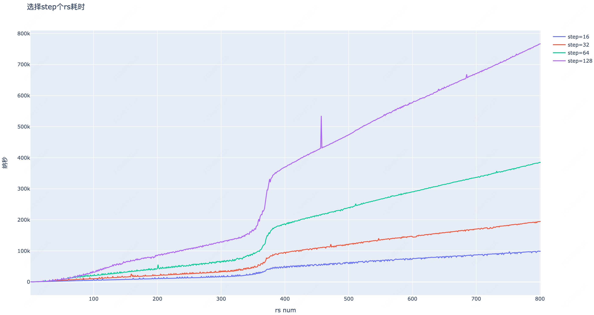

每一轮调度计算控制在 100k 纳秒以内

| **rs num** | **step** |
| ---------- | -------- |
| <= 200     | 128      |
| <= 300     | 64       |
| <= 400     | 32       |
| more       | 16       |

**GCD 优化**

调度顺序表的长度取决于总权重，但实际上会以所有 RS 权重的最小公倍数为一轮（实际上权重本来就可以除最大公约数进行约分，等效权重），所以只需要存放 GCD 后的总权重长度

**问题：**分步计算、权重更新和乱序算法

1. 现在的分布计算会在**前几次调度时计算**下一个 Step 的调度顺序表 -> 改为 next_idx 快到 next_init_idx 时再计算下一个 Step，**打散调度顺序的计算**
2. 每次有 RS 的**权重更新**都会导致调度顺序表需要重新计算。如果有频繁的权重更新，会使得调度顺序表的计算开销被放大 -> 问题1的解决方案能部分保证**不会连续的计算** Step 内调度顺序 + 调度顺序的计算现在放在 CTRL 线程，因读写锁与 WORKER 的调度互斥，改为 **RCU** 机制使计算时的调度可以继续用旧的调度顺序表来做调度选择？ + **全局完整**的调度顺序表计算（阻塞 CTRL 线程），WORKER 本地只随机 next_idx？
3. 当前的**乱序算法**是将所有 RS 以随机顺序挨个添加到新的临时链表里，O(N^2) -> 参考**洗牌算法**，BV1tNKfz1Eqc
   1. 每张牌给随机值，按照随机值排序，时间 O(NlogN)，空间 O(N) 但可以和 Maglev 一致性哈希共用偏好数组
   2. 新版 Fisher-Yates 算法：依赖数组 O(1) 取值。维护牌堆数组的洗好和未洗两部分，每次将未洗的最后一张牌 last_idx 与随机未洗位置 random_idx (0 ~ last_idx) 的牌 O(1) 交换，并将最后一张 last_idx 当作洗好的部分。最终可以 O(N) 时间随机洗牌 -> 需要额外存储一个 RS 数组用来取 random_idx

## 从数据包间存在长短差异的角度

数据包之间会有长短（尽管这在 LB 认为是一致的），它可能影响的更多是收发包的时间开销（假设 RS 正在大量收包甚至接近超过处理能力范围，RS 的收包成为瓶颈。因为 LB 不需要考虑这种情况，所以只做简单介绍）

参考上一章的权重分配，这里将数据包的大小作为权重的影响因素。刚发送了长数据包的 RS 不应成为下一次的选择

### DWRR

* DWRR (Deflicit Weighted Round Robin，赤字轮询)

赤字计数器表示此轮可以发送的最大字节数，如果其大于等于数据包大小则此轮可以发送（并将计数器减掉数据包大小），否则放到下一轮考虑。赤字计数器每轮均等增加或按照权重配置增加。对应到 LB 是为所有 RS 维护赤字计数器，每轮增加权重值，并选择下一个计数器值大于数据包大小的 RS 调度

**不同的 WRR 算法对比**

| **Algorithm Compare**        |                                                              |                                                              |
| ---------------------------- | ------------------------------------------------------------ | ------------------------------------------------------------ |
| (I)WRR (Packet number level) | 循环调度的**周期短** (RR IWRR)<br />实现简单，不需要维护太多信息<br />可以让**权重延迟更新**，不需要立刻响应权重变化 | 大报文获得的实际**带宽**要大于小报文<br />**权重差值**较大会导致最后大量新连接连续打到同一个 RS |
| DWRR (Bandwidth level)       | 考虑**报文长度**带来的带宽分配问题                           | LB 不需要考虑报文长度和带宽分配                             |
| SWRR (Packet level)          | **平滑**解决连续打到同一个 RS 的问题                         | 每次调度都需要查找并维护，**O(N)**<br />初始时以及动态调整权重时，所有 WORKER **相同序列**调度压力同一个 RS |
| VNSWRR (RS level)            | 预先计算调度顺序，**O(1)** 调度<br />**打散**初始时和调整权重时到 RS 的流量<br />**分步 step** 更新减缓调度计算开销 | WORKER 之间**不共享**，每个单独计算一遍调度顺序表<br />next_idx **随机范围**不是完整的调度顺序表长度 |

## 从服务器连接状态的角度

相比于预定义的权重信息，统计当前的连接状态可以更灵活的处理 RS 的调度选择问题

因为 LB 以集群方式部署，本身从 RS 上收集会更能表示其真实的已有的连接状态，但是需要改造 RS 以例如 Sidecar 模式额外的收集信息且对 RS 造成了额外的开销。对 LB 更优的方式是在自己集群内进行全局的统计

### minConn

* minConn (最小连接数)

维护对所有 RS 的连接数统计（借会话同步来收集其他 LB 机器上的连接数信息），每次选择当前连接数最少的 RS 调度。通过维护连接数最小堆的方式 O(1) 的选择调度并 O(logN) 的维护。但是由于 WORKER 之间不共享，需要额外的定时任务来收集所有 WORKER 的连接数信息更新到每一个 WORKER 本地，且面对大量的连接数更新，直接重建堆；由于集群内不共享，需要依靠会话同步的方式来获取其他机器的连接数统计

**问题：**WORKER 间不共享、集群内不共享（长短连接）和权重配置

既然应该选择全局（或者说从 RS 角度）的最小连接，在追求效率而**不共享**的 LB 就需要其他的方式来共享连接数信息。

1. 定时任务收集**所有 WORKER** 连接数信息和重建最小堆
2. **集群内**会话同步只收集长连接，面对大量持续建立的新**短连接**没有办法建立全局视野
3. minConn 调度时不会考虑 RS 的**权重分配**，建立连接时只会将本 WORKER 连接数 + worker_cnt -> 建立连接时连接数 + worker_cnt * weight，统计时也直接计算 conn_cnt * weight 来建堆（注意这里"权重"越低，"权重"越高 :) 或者改为除权重后向上取整

## 从完全随机的角度

通过哈希的方式可以保证相同的明文值每次都会哈希为相同的密文（幂等性），可以额外的保证例如相同的 QUIC CID 转发到相同的 RS 进行处理，或是断开的连接依靠相同的五元组打回与上一次连接相同的 RS

**公平性**依靠哈希算法的**散列程度**

### 哈希取模

* hash

根据某一个特定的值进行哈希（随机打散），再对 RS 数量取模

LB 本身存储 RS 是以链表和哈希桶的方式，需要再额外以数组形式存储调度顺序表以保证 O(1) 的调度选择

**问题：**可以看到其调度公平的影响因素为哈希算法和 RS 数量

1. 首先需要保证哈希明文的唯一和哈希结果尽量分散，尤其当 **RS 数量较少**的时候，若再遇到哈希碰撞就会导致很明显的调度不均 -> **填充虚拟节点**
2. **RS 数量变化**会导致之前哈希的结果都发生改变 -> **一致性哈希**降低影响

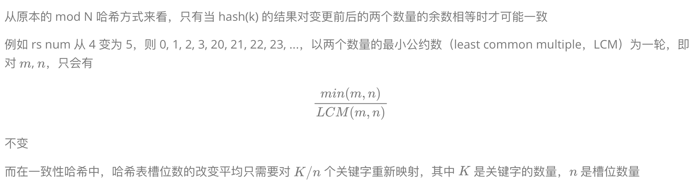{width="5.5in"
height="1.4780511811023622in"}

### 一致性哈希

考虑到扩缩容是很常见的事情，一致性哈希希望能减小扩缩容带来的影响

但是对 LB 来说，大多数只需要选择出调度的结果，并不需要对之前的调度结果负责（已由 CT 记录）。但是在 QUIC CID Hash 场景下，哈希带来的影响就更有必要考虑了

#### 哈希环（割环法）

> 1997

* 哈希环（割环法）

哈希值映射到一个大圆环 (2^32) 空间内的槽位，查找时在圆环中顺时针查找映射过的槽位

当往一个哈希环中新增一个槽位时，只有被新增槽位拦下来的哈希结果的映射结果是变化的


当从一个哈希环中移除一个槽位时，被删除槽位的映射会转交给下一槽位，其他槽位不受影响

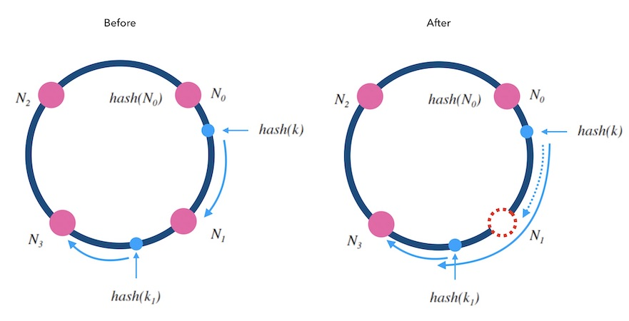

在实际应用中，还可以对槽位（节点）添加**权重**，通过构建很多指向真实节点的虚拟节点，也叫影子节点。通常采用一个节点创建 40 个影子节点，节点越多映射分布越均匀。影子节点之间是平权的，选中影子节点，就代表选中了背后的真实节点。权重越大的节点，影子节点越多，被选中的概率就越大。但是需要注意的是，影子节点增加了内存消耗和查询开销，权重的调整也会带来数据迁移的工作


**优势：**一致性哈希和权重分配

**问题：**调度查找开销和额外空间开销

1. 调度时需要在哈希环中顺序的查找到槽位（或虚拟节点），造成额外的**查找开销** -> 预先填充整个哈希环，应该可以看作 O(1) 调度查找
2. 需要开辟大量**空间**用来做哈希环和影子节点
3. 哈希环算法的映射结果不是很均匀，当有 100 个影子节点时，映射结果的分布的标准差约 10%；当有 1000 个影子节点时，降低到约 3.2% 

> [一致性哈希：算法均衡 by Damian Gryski](https://dgryski.medium.com/consistent-hashing-algorithmic-tradeoffs-ef6b8e2fcae8#890d)

> 实际的实现方式：
> 1. 建立以影子节点 hash 值排序的虚拟节点链表，并在这基础上以类似跳表的形式加速查询时 hash 定位影子节点
> ```c
> hash_ring {
> len;  // shadow_node length = sum(node * weight * shadow_cnt)
> shadow_node list;
> }
> shadow_node {
> *rs;
> hash;
> *next_shadow_node;
> }
> jump_list[level][] = {};
> ```
> 跳表的层数和删除，逻辑复杂
>  
> 2. 改为用数组存储虚拟节点表，同样以影子节点的 hash 值排序。查找时对查询的 key hash 值二分查找，简化逻辑（普遍选择的做法）
> 查询同样是 O(logN)
>  
> 3. 平铺预填充，对 hash 值范围进行限制，将 RS 指针直接填充到 hash 范围大小的数组里 O(1) 查找
> 如果是 32bits 的哈希范围，就代表需要开辟 sizeof(ptr) * pow(2, 32) 大小的数组，4 字节指针时总存储约为 17GB。但如果是 16bits (65536)，就只需要 256KB

#### Jump Hash 跳跃一致性哈希

* Jump Hash 跳跃一致性哈希

> A Fast, Minimal Memory, Consistent Hash Algorithm
> https://arxiv.org/abs/1406.2294
> 2014

```
int32_t JumpConsistentHash(uint64_t key, int32_t num_buckets) {
    int64_t b = -1, j = 0;
    while (j < num_buckets) {
        b = j;
        key = key * 2862933555777941757ULL + 1;
        j = (b + 1) * (double(1LL << 31) / double((key >> 33) + 1));
    }
    return b;
}
```

当槽位数量发生变化时，可以直接计算有多少个哈希结果需要重新映射。通过伪随机数来决定一个哈希结果每次要不要跳到新的槽位中去，最终只需要保证新的桶中有 key_cnt / slot_cnt 个从前面槽位移动过来的 key 即可保证最小化重新映射

由于是通过伪随机的方式，并将哈希 key 作为伪随机数种子，对于给定的哈希槽位数量，key 的映射结果都是唯一确定的

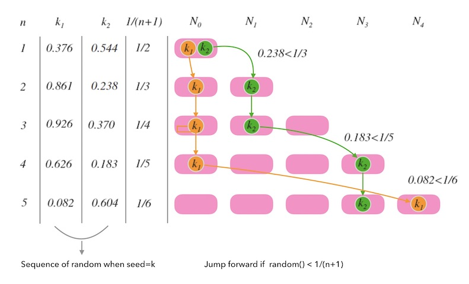

「伪随机哈希优化」

在上面的实现里，需要判断 N 次伪随机值来确定是否要跳跃到当前的最大桶上，计算哈希所需要花费的时间时间 O(N)。但是注意到元素只有很小的概率会移动，它只会在桶增加时移动，且每次移动都必然移动到最新的桶里，即如果一个元素移动到 b 号桶（从 0 开始计号）里，必然是因为桶增加到 b+1 个导致。所以我们只需要求出下一次移动的目标 j，即可跳过 b+2 ... j 次伪随机的步骤

下一次移动到 j 意味着 b+2 ... j 都伪随机到了不移动。另我们知道当桶增加到 N 个时元素的移动概率为 1/N，不移动的概率为 (N-1)/N。所以元素移动到 j 的概率 Pj 为
$$
Pj = (b+1)(b+2)(b+3)...(j-1) / (b+2)(b+3)(b+4)...j = (b + 1) / j\\
j = (b + 1) / Pj
$$
那么我们可以改变思路，将 Pj 作为伪随机的值 r，就可以直接通过伪随机值来获取 j 了
$$
j = floor((b + 1) / r)
$$
优化前的代码为

```
int consistent_hash(int key, int num_buckets) {
    srand(key);
    int b = 0;
    for (int n = 2; n <= num_buckets; ++n) {
        if ((double)rand() / RAND_MAX < 1.0 / n)
            b = n - 1;
    }
    return b;
}
```

优化后的代码为

```
int consistent_hash(int key, int num_buckets) {
    srand(key);
    int b = 1, j = 0;
    while (j < num_buckets) {
        b = j;
        r = (double)rand() / RAND_MAX;
        j = floor((b + 1) / r);
    }
    return b;
}
```

最终将跳跃一致性哈希算法的时间优化到 O(logN) 

**优势：**在执行速度、内存消耗、映射均匀性上都比哈希环算法更好，时间可以由 O(N) 优化至 O(logN)

**问题：**

1. 无法自定义槽位标号，必须从 0 开始，意味着需要 rs_buf 数组
2. 只能在**尾部增删**节点，导致删除中间节点 i 需要先把后面所有的 [i:] 都删掉，再把 [i+1:] 的添加回来 -> LB 不需要持久化连接（维护已建立过的连接 key）不需要管

> 实际的实现方式：
>
> 1. 在负载均衡调度的场景下，如果一个连接建立后断开，下一次又来建立连接，就要看是否需要重回到之前的调度，这也是一致性哈希想要控制的问题。如果不需要对持久化做 100% 保证，那么跳跃一致性哈希就不需要维护 key 的移动，仅仅需要使用  `JumpConsistentHash` 选择出调度的 RS 即可
>
>    RS_idx <- JumpConsistentHash <- key(srcIP or QUIC cid), RS_num

#### Multi-Probe 一致性哈希 (MPCH)

* Multi-Probe 一致性哈希

> Multi-Probe Consistent Hashing
>
> https://arxiv.org/abs/1505.00062
>
> 2015

目标：灵活调节节点大小和降低方差

基本思想是在哈希环的基础上查找时对 key 进行 k 次哈希，返回所有哈希查询中距离最近的节点。k 的值由所需的方差决定。对于峰均值比 1.05（负载最重的节点最多比平均值高 5%），k 为 21。作为对比，哈希环算法需要 700lnN 个副本。对于 100 个节点，这相当于超过 1MB 内存

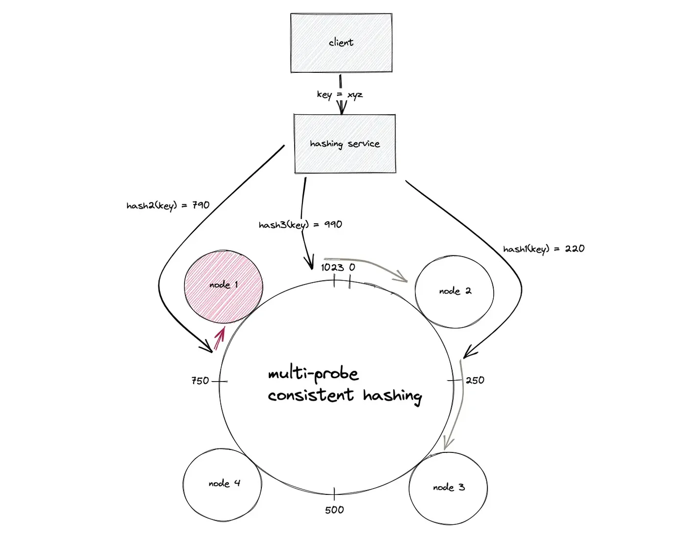

#### Maglev 一致性哈希

* Maglev 一致性哈希

> Maglev: A Fast and Reliable Software Network Load Balancer
>
> https://research.google/pubs/maglev-a-fast-and-reliable-software-network-load-balancer/
>
> 2016

建立一个槽位查找表，对输入 key 哈希取余就可以映射到一个槽位。计算查找表需要为每个槽位生成一个偏好序列 Permutation，按照偏好序列中数字的顺序，每个槽位轮流填充查找表。如果填充的目标位置已被占用，则顺延该序列的下一个目标位置填充


伪代码

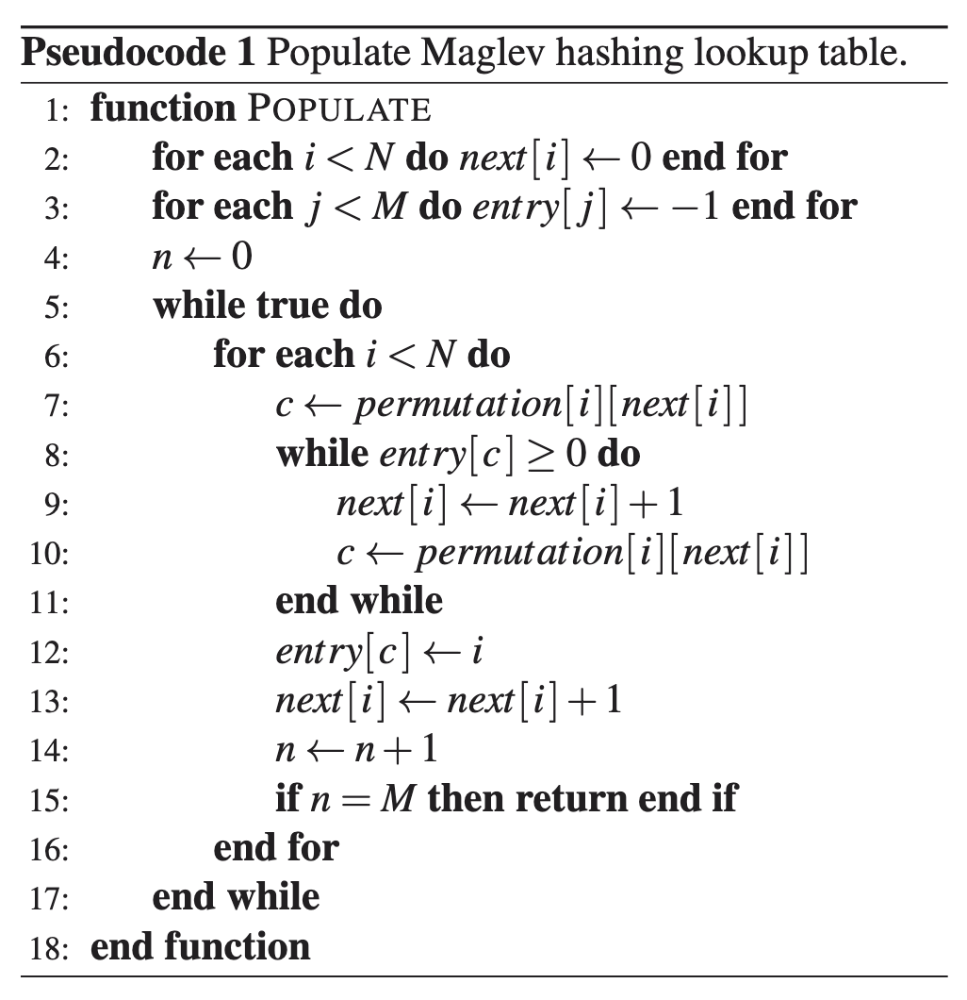

由于存储了偏好序列表，槽位的变动对查找表的影响就是可控的了


生成偏好序列的方式有很多，只需要保证其随机和均匀。查找表的长度 M 应是一个质数，这样可以减少哈希碰撞和聚集，让分布更均匀。查找表建立时间 O(MlogM)，最坏 O(M^2)

如果想要实现**带权重**的 Maglev 哈希，可以通过改变槽位间填表的相对频率来实现加权

> 关于时间复杂度计算，可以参考 [Maglev 哈希的复杂度分析](https://writings.sh/post/consistent-hashing-algorithms-part-4-maglev-consistent-hash#maglev哈希的复杂度分析)

「随机生成偏好序列 permutation」

Google 方法是，取两个无关的哈希函数 h1 h2，给槽位 b 生成时，先用哈希计算 offset 和 skip
$$
offset = h1(b) \% M\\
skip = h2(b) \% (M-1) + 1
$$
然后对每个 j，计算
$$
permutation[j] = (offset + j * skip) \% M
$$
这里通过类似二次哈希的方法，使用两个独立无关的哈希函数来减少映射结果的碰撞次数，提高随机性。但是这要求 M 必须是质数，才能保证与 skip 互质，最终遍历完整个 M

「槽位增删分析」

> Experiments in Google Paper Section 5.3

实验设置：1000 台后端服务器，对每个 k-failure 重新生成查找表并检查入口变化，重复 200 次取平均值

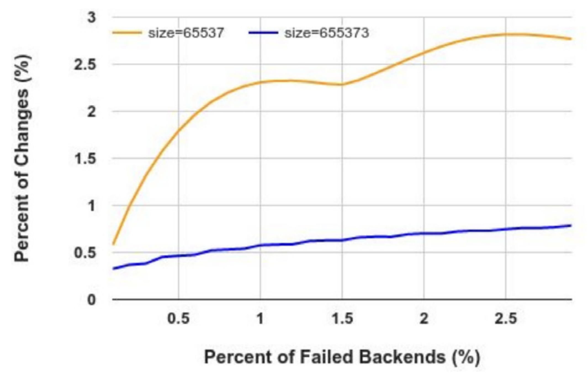

按照实验结果，M = 65537，k = 5 时，只有约 1180 个入口会变化 (约 1.8%)

> Google 论文中说核心关注的两个问题是：
> 1. **load balancing**: each backend will receive an almost equal number of connections.
> 2. **minimal disruption**: when the set of backends changes, a connection will likely be sent to the same backend as it was before
> 其中第一个是最为关键的，同时 Maglev 每个 VIP 绑定到后端的几百个服务器，每个都需要很大的 lookup table。并且，尽管想要最小化一致性哈希在扩缩容场景下的变化，但因为有 connections' affinity 亲和性 (conntrack) （且连接复用的 reset 也是被允许的），少量的槽位增删干扰也是可以接受的


**优势：**O(1) 的调度查找、均匀且一致性的哈希映射和可以增加权重的影响

**问题：**

1. 需要**额外存储**每个槽位的偏好序列和槽位查找表 (rs_buf)
2. 虽然避免了全局重新映射，但是没有做到最小化的重新映射
3. Google 的测试里，65537 大小的查找表生成时间为 1.8ms，655373 大小的查找表生成时间为 22.9ms

#### AnchorHash 一致性哈希

> AnchorHash: A Scalable Consistent Hash
> https://arxiv.org/abs/1812.09674
> 2020

* AnchorHash 一致性哈希

> 池化+标记的思想，通过复用来减少重映射

想解决槽位增删时的高迁移成本和平衡性下降问题

预先定义固定大小 a（预期可能达到的最大节点规模）的虚拟节点集合为锚点集，工作节点是锚点集的子集

当对 key 分配时，

1. 先用 H1(key) 映射到锚点集的一个桶 b
2. 如果桶 b 是工作节点，则直接分配
3. 否则启动回填过程
   1. 用另一个哈希 H2(key) 计算一个起始点
   2. 在锚点集按顺序查找下一个是工作节点的桶 b'

设计了一个 next 数组用来表示当前桶不可用时应该从哪找下一个候选桶，在节点增删时维护 next 指针

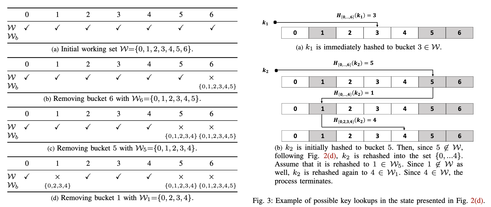

GetBucket 时间为 $1+ln(\dfrac{a}{w})$

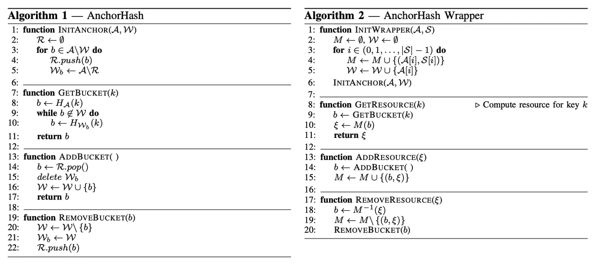

M: Mapper from anchor A to rs S

R: Removed label

**优势：**

1. 删除节点时，只影响直接映射到该节点桶以及通过回填路径依赖该桶的 key
2. 存储固定大小的数组记录，不需要虚拟节点
3. 查找通常只需要一次初始哈希和平均不到一次回填跳转
4. 不会因为其他节点的增删而影响当前节点的映射 key
5. 负载平衡性高较均匀，键分配到工作节点的方差较低

**问题：**

1. 额外的内存开销来存储三个 O(a) 数组 workers, removed, next
2. 新增节点只接收映射到它自身桶的新键和未来因其他节点离开而回填的键，不会立即分担现有节点的负载
3. 需要维护 next 指针的逻辑较为复杂

#### DxHash 一致性哈希

> DxHash: A Scalable Consistent Hashing Based on the Pseudo-Random Sequence
>
> arxiv.org/pdf/2107.07930
>
> 2021

* DxHash 一致性哈希


NSArray 是长度为大于 `RS_num` 的最小 $2^n$ 值，例如 RS 是 4 台，则 NSArray 长度为 8

通过伪随机数机制来保证同一个 key 有固定有序且无羡长度的服务器序列

>  Minimal Disruption: the changed node is either the original or the destination of the remapped keys.

为了防止无限长的服务器序列一直映射不到活动节点，DxHash 对搜索的次数限制到 8n，n 为 cluster size
$$
P = (\frac{n - 1}{n})^{8n}
$$
当 n 足够大时，P 接近 $\dfrac{1}{e^8}$，约为 0.03%，作者认为概率足够小

NSArray 不够时进行两倍扩容+节点迁移

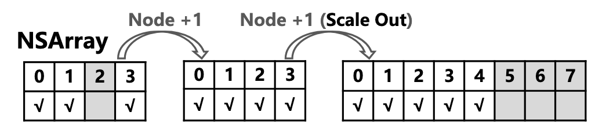

可以以类似切片的形式来保证不会需要节点迁移

「质疑」作者没有讲 NSArray 扩容后出现的大量变化的重映射问题

> When the cluster reaches its maximum capacity and all items in the NSArray are active, DxHash behaves as a classic hash algorithm that maps objects to nodes with a single calculation.

权重通过虚拟节点层实现

#### 一致性哈希算法对比

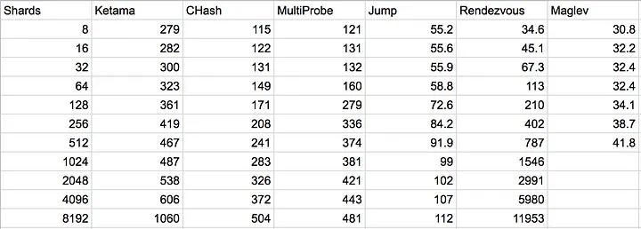

不同节点数量时单次查询的时间（纳秒）

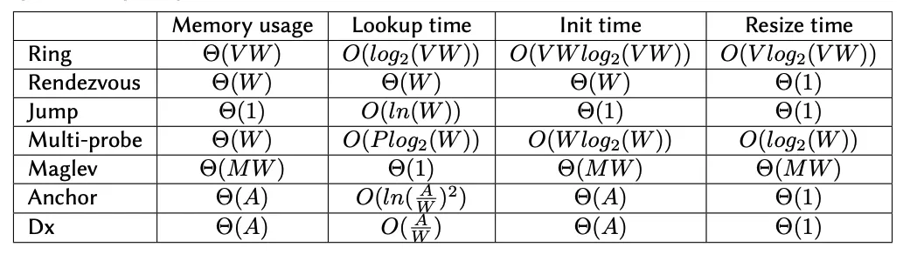

* 𝑉：ring 中每个物理节点对应的虚拟节点个数
* 𝑊：集群中的 working 节点数目
* 𝑃：Multi-probe 中的探针(哈希)个数
* 𝑀：Maglev 中每个节点在查询表中的位置数
* 𝐴：集群中的所有节点数(包括 working 和非 working 的节点)

|                | 均匀性 | 最小化重新映射 | 时间复杂度 | 加权映射 |
| -------------- | ------ | -------------- | ---------- | -------- |
| 哈希环         | 还行   | ✅              | O(logN)    | ✅        |
| 跳跃一致性哈希 | ✅      | ✅              | O(logN)    | ✅        |
| Maglev 哈希    | ✅      | 还行           | O(1)       | ✅        |

### Rendezvous 哈希

> 1997

* Rendezvous Hash

「核心思想」

如果只是对服务器 ID 进行哈希，那么当修改服务器的数量时，所有的哈希值都会发生变化。当对目标服务器的选择和服务器的数量没有直接关系时，就可以避免服务器的增删带来的影响

「算法思路」

为每个 key 生成一个随机有序的服务器列表，并选择列表中的第一个作为目标服务器

如果选择的第一台服务器下线时，只需要将 key 转移到列表中的第二台服务器并作为新的第一台服务器即可

1. 对每个服务器计算 key:rs_id 哈希来生成一组整数哈希值
2. 基于该哈希值对服务器进行排序，得到一个随机排列的服务器列表

对于有权重分配的场景，可以基于 w / lnh(x) 排序，h(x) 哈希范围在 [0, 1]

**优势：**

1. 将服务器选择**和数量完全解绑**，并提供了第二选择服务器，解决了哈希级联故障转移的问题
2. 没有额外的**内存存储开销**

**问题：**调度的时间开销和扩容影响第一选择

1. Rendezvous 哈希进行调度时需要对所有 RS 进行哈希计算并排序，**时间开销** O(NlogN)。实际上在取 RS 哈希时应该先检查存活，所以只需要 O(N) 查找哈希值最大的一个即可
2. 扩容时新服务器可能成为一些已有 key 的第一选择，所以**很难维护第一选择的不变**。在分布式存储场景下需要重新校验所有 key，但在缓存和负载均衡场景下影响可以接受

「变体」

调度时间优化至 O(logN)。把原始节点分成若干个虚拟组，虚拟组一层一层组成一个“骨架”，然后在虚拟组中按照 Rendezvous 哈希计算出最大的节点，从而得到下一层的虚拟组，再在下一层的虚拟组中按同样的方法计算，直到找到最下方的真实节点

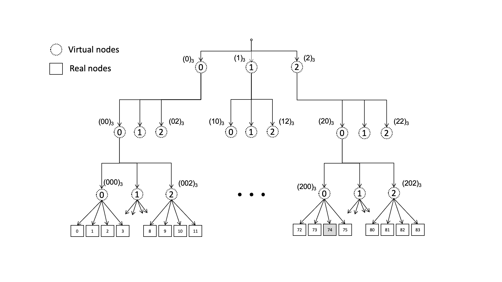

「扩展思考」

对每个 RS 都计算哈希并排序的时间开销较高，可以改为直接以 key 哈希后进行切分，每 MAX_RS_NUM (1024 10bits) 为一组，顺序判断对应的 RS 是否存在并存活，维护 RS 数组且在删除时不向前移动补齐。或是提供第二种哈希算法作为备选

目的：提供第二选择，而非在 rs_buf 中顺序的向后查找

### Locality Sensitive 哈希 (LSH)

> [LSH 位置敏感哈希入门](https://randorithms.com/2019/09/19/Visual-LSH.html)


「进阶」

Multi-Probe LSH

核心思想是使用一个严格挑选的探测序列来检测多个可能包含最近邻点的桶，增大找到近邻点的概率。实验证明，在保证相同时间效率的情况下，减少了一个数量级的哈希表数量；在保证相同的搜索质量的情况下，减少了查询时间，同时少用了 5-8 倍的哈希表。 

「扩展思考」

LSH 在这里引入是因为它会将相似的 key 更有可能计算出相同的哈希结果（即发生哈希碰撞），在以地理位置等进行划分的场景下可能会有用，这里不做详细介绍 

## 产品实现

### Bilibili

LB 1.0

* WRR
  * 问题
    * 无法快速摘除有问题的节点
    * 无法均衡后端负载
    * 无法降低总体延迟

LB 2.0

* 动态感知的 WRR
  * 方式
    * 利用每次 RPC 请求返回的 Response **夹带 CPU 使用率**
    * 每隔一段时间整体调整一次节点的权重分数
    
    $$
    peer.score = success\_rate \div (lantency \times cpuUsage)
    $$
  * 问题
    * 信息滞后和分布式带来的羊群效应 (VNSWRR 想解决的问题)

LB 3.0

* 带**时间衰减**的 Exponentially Weighted Moving Average 带系数的滑动平均值，实时更新延迟、成功率等信息，尽可能获取最新的信息
* 引入 best of two random choices 算法，加入**随机性**，在信息延迟较高的场景有效果
* 引入 inflight 作为参考，**平衡坏节点流量**，inflight 越高被调度到的机会越少

> The power of two choices in randomized load balancing [Papaer]

计算权重分数 $success \times metaWeight \div (cpu \times math.Sqrt(lag) \times (inflight + 1))$

* success: 客户端成功率
* metaWeight: 在服务发现中设置的权重
* cpu: 服务端最近一段时间内的 cpu 使用率
* lag: 请求延迟
* inflight: 当前正在处理的请求数

lag 计算

```go
// 获取&设置上次测算的时间点
stamp := atomic.SwapInt64(&pc.stamp, now)
// 获得时间间隔
td := now - stamp
// 获得时间衰减系数
w := math.Exp(float64(-td) / float64(tau))
// 获得延迟
lag := now - start
oldLag := atomic.LoadUint64(&pc.lag)
// 计算出平均延迟
lag = int64(float64(oldLag) * w + float64(lag) * (1.0 - w))
atomic.StoreUint64(&pc.lag, uint64(lag))
```

best of two 算法

```go
a := rand.Intn(len(p.conns))
b := rand.Intn(len(p.conns) - 1)
if b >= a {
    b = b + 1
}
nodeA := p.conns[a]
nodeB := p.conns[b]
if nodeA.load() * nodeB.health() * nodeB.Weight > nodeB.load() * nodeA.health() * nodeA.Weight {
    pick_node = nodeB
} else {
    pick_node = nodeA
}
```

### 美团 MGW

* CHash (srcIP)
  * 哈希环：因为 MGW 是以集群的形式存在的，当多个应用服务器发生上线下线操作时，反馈到不同的 MGW 节点上就有可能会出现顺序不一致的问题，因此无论不同的 MGW 节点产生何种应用服务器上下线顺序，都需要保证最终的映射关系一致，因为如果不一致就导致相同客户端的连接会被不同的 MGW 节点调度到不同的应用服务器上，也就违背了源 IP  Hash 调度器的原则
  * 分享文档提到了 Maglev

> RS 平滑下线：保证此 RS 已有连接正常工作，但不会往上面调度新的连接。当所有已有连接结束以后，MGW 会上报一个结束的状态，用户就可以根据这个结束的状态对 RS 进行升级操作，升级后再调用上线接口让这个 RS 器进行正常的服务

> 故障切换：交换机侧全部使用物理接口并且服务器侧对接口进行断电时，交换机会瞬间将流量切换到其他机器上，是 0 丢包的。但是网卡驱动是跑在主程序里面的，当主程序挂掉以后，就无法再对网口执行断电操作了，因此为了解决这个问题，主进程会捕获异常信号，当发现异常时就对网卡进行断电操作，在断电操作结束以后再继续将信号发给系统进行处理

> 恢复与扩容：MGW 上线有一个预上线的中间状态，不让交换机感知到自己上线（不会把流量切过来），先进行 CT 同步
>
> 1. 由于集群中并没有一个主控节点来维护一个全局的状态，如果 request 报丢失或者 session 同步的数据丢失的话，那新上线节点就没办法维护一个全局的 session 状态。但是考虑到所有节点都维护着一个全局的 session 表，因此所有节点拥有的 session 数量都是相同的，那么就可以在所有节点每次做完批量同步以后发送一个 finish 消息，finish 消息中带着自己拥有的 session 数量。当新上线节点收到 finish 消息以后，便会以自己的 session 数量与 finish 中的数量做对比。当达到数量要求以后，新上线节点就控制自己进行上线操作。否则在等待一定的超时时间以后，重新进行一次批量同步操作，直到达到要求为止
> 2. 在进行批量同步操作时，如果出现了新建连接，那么新建连接就不会通过批量同步同步到新上线的机器上。如果新建连接特别多，就会导致新上线机器一直达不到要求。因此，需要保证处于预上线状态的机器能接收到增量同步数据，因为新建连接可以通过增量同步同步出来。通过增量同步和批量同步就可以保证新上线机器可以最终获得一个全局的 session 表

### Huawei

* WRR
  * **依次**将请求分发给不同的服务器。权重大的后端服务器被分配的概率高，相同权重的服务器处理相同数目的连接数
  * 短连接
  * 会话保持类型：源 IP
* W-minConn
  * 给每个服务器分配不同的权重，使其能够**接受相应权值数的服务请求**
  * 长连接，**实时监控**连接数变化，降低峰值负载
  * 只能统计 LB 与 RS 之间的连接，RS 整体连接数无法获取；新增 RS 时可能导致过载
  * 会话保持类型：源 IP
* sip hash
  * 一致性哈希
  * 用来保持用户状态或会话的应用
  * 已默认支持源 IP 会话保持
* QUIC cid hash
  * 会话保持类型：源 IP

> 注意到 DGW 里之前也支持全调度算法的 sticky，最后限制了只有完全随机的 sip hash 可以有 sticky。可以想象例如 WRR 调度新连接时并不会考虑之前有多少 sticky 连接，这会导致权重之间的差异被无限放大
>
> 相当于不是按照**连接级别**在调度，而是按照**客户端**的级别
>
> 但是在一致性哈希上，会话保持是有意义的，它为之前调度过的源 IP 持久化调度选择，从而防止如扩缩容、cid 变更等带来的 CT 失效

### Aliyun

* RR
* WRR
* W-minConn
* CHash (srcIP, 4-tuple, QUIC ID)

> 阿里云只在 CHash 部分提到了会话保持（哈希特性自带），并没有说明有提供类似 sticky 的保持能力。扩缩容时会导致一部分请求需要重新分配
>
> 虽然 NLB 和 CLB 支持 QUIC ID 哈希，但仅支持 Q10、Q29 版本

### Nginx

* WRR 默认和兜底，其他调度算法一直尝试失败会改为默认算法
  * nginx/src/http/ngx_http_upstream_round_robin.c : ngx_http_upstream_get_peer
* least-connect (W-minConn)
  * nginx/src/http/modules/ngx_http_upstream_least_conn_module.c : ngx_http_upstream_get_least_conn_peer
* W-ip-hash (srcIP)
  * nginx/src/http/modules/ngx_http_upstream_ip_hash_module.c : ngx_http_upstream_get_ip_hash_peer
* W-chash 哈希环
  * nginx/src/http/modules/ngx_http_upstream_hash_module.c : ngx_http_upstream_update_chash
* random
  * nginx/src/http/modules/ngx_http_upstream_random_module.c : ngx_http_upstream_peek_random_peer
* Fair Queueing 公平队列：根据后端节点服务器的响应时间来分配请求

注意，文档中说只有 ip-hash 有会话保持

> **为什么 Nginx 实现的所有的调度算法都没有想要空间换时间，全部都是 O(N) 的查找？**
> 1. **动态权重和状态**：
>   - **核心原因-权重可变性：**Nginx 支持运行时动态调整后端服务器的权重（weight）。这是管理员进行灰度发布、流量调整、临时降级等操作的核心手段。这会导致 **O(1) 预计算失效。**在权重频繁调整（即使是偶尔）或服务器数量（N）很大的场景下，这个重新计算的成本（O(N) 或 O(NlogN) 甚至更高）会变得非常高，并且可能发生在处理请求的关键路径上，造成延迟抖动
>   - **状态感知算法**：像 least_conn（最小连接数）和 least_time（最短响应时间）这类算法，其选择标准完全依赖于后端服务器的实时状态，无法预先计算出一个固定的调度序列
> 2. **N 通常较小**：
>   - **现实集群规模**：在绝大多数实际部署中，一个 upstream 块（后端服务器组）包含的后端服务器数量 N 通常是有限的，一般在几十台到一两百台的量级。对于这个数量级，O(N) 的遍历在现代 CPU 上可能是纳秒到微秒级别。**O(1) 优势不明显**，O(1)  算法（如哈希表查找）带来的绝对时间节省非常有限，甚至可能因为哈希计算、可能的哈希冲突处理、缓存不友好等原因，其常数因子比简单的顺序遍历更大，导致实际性能反而不如  O(N) 遍历。顺序遍历对 CPU 缓存非常友好（线性访问内存）
> 3. **内存效率**：
>   - **预计算序列的内存开销**：预生成完整的轮询序列（尤其是考虑权重时）需要额外的 O(S) 内存空间，其中 S 是所有服务器权重之和
>   - **Nginx 的内存优化倾向**：Nginx 以高性能和低内存消耗著称
> 4. **算法简单性与鲁棒性**：
>   - **实现简单**：O(N) 的遍历算法实现起来相对简单、清晰，代码易于理解和维护
>   - **鲁棒性好**：简单的顺序遍历对后端服务器的动态变化（增、删、权重改、状态变）响应直接且自然。预计算序列在动态变化时需要复杂的更新或失效机制，容易引入边界条件错误
>  
> 总结:
> Nginx 在核心负载均衡算法（轮询、加权轮询、最小连接、最短时间）中选择 O(N) 的调度查找策略，是经过深思熟虑的权衡：
>   - **核心制约因素**：支持动态权重和实时状态感知使得 O(1) 的预计算序列方案在动态更新时成本过高或不适用
>   - **现实可行性**：对于典型的后端服务器数量 (N)，O(N) 遍历的绝对时间开销非常低，在现代 CPU 上完全可以接受
>   - **资源优化**：避免了为 O(1) 选择而预计算序列或维护大型哈希表带来的显著额外内存消耗
>   - **设计哲学**：符合 Nginx 追求简单、高效（尤其是内存效率）和鲁棒性的设计原则
> 因此，尽管在纯算法理论上看 O(N) 不如 O(1) 或 O(log N)，但在 Nginx 负载均衡的具体上下文、约束条件（动态权重、状态感知）和典型部署规模下，O(N) 的遍历是一个非常合理且高效的工程选择。它用微小的、可接受的 CPU 时间增量，换取了算法的灵活性、低内存开销和对动态变化的自然支持

**「SWRR」**

```c
# nginx/src/http/ngx_http_upstream_round_robin.c : ngx_http_upstream_get_peer
for (peer = rrp->peers->peer, i = 0;
     peer;
     peer = peer->next, i++)
{
    if (peer->down) {
        continue;
    }


    if (peer->max_fails
        && peer->fails >= peer->max_fails
        && now - peer->checked <= peer->fail_timeout)
    {
        continue;
    }


    if (peer->max_conns && peer->conns >= peer->max_conns) {
        continue;
    }


    peer->current_weight += peer->effective_weight;
    total += peer->effective_weight;


    if (peer->effective_weight < peer->weight) {
        peer->effective_weight++;
    }


    if (best == NULL || peer->current_weight > best->current_weight) {
        best = peer;
        p = i;
    }
}
best->current_weight -= total;
return best;
```

**问题：**

1. 可以看到 Nginx 仍然在使用 SWRR 算法，相比于 VNSWRR 它的优势在哪里？
2. 注意到 24-26 行，是否意味着后续可以配置热更新权重并动态缓慢的更新有效权重？

weight: 配置文件中的权重

effective_weight: 动态的有效权重，初始化为 weight。当和 RS 通信发生错误时减小，后续逐步恢复

 

「扩展思考」在系统初始时，通过将所有 effective_weight 初始化为 1 来放大随机效果（选 best 时也可以添加随机数判断 peer->current_weight == best->current_weight 时是否要替换 best = peer）

但是参考 `ngx_http_upstream_init_round_robin` 初始化中的赋值，都会有 peer.weight = peer.effective_weight = server.weight

 

**「W-chash」**

创建了 weight * 160 个影子节点，根据哈希值排序

抽离版实现可参考 [libchash/chash.c](https://github.com/dgryski/libchash/blob/master/chash.c)

 

**「ip-hash」**

对 IP 地址哈希后取模 RS 总权重，然后依次减掉每一个 RS 的权重看落在哪个 RS 里，从而将权重作为影响因素放入直接哈希

 

**「least-connect」**

顺序遍历 O(N) 查找连接数最小的 RS

出现相同的最小连接数时，回退到 SWRR 进行选择

比较连接数时，因为是遍历的两两比较，可以通过 peer->conns * best->weight < best->conns * peer->weight 来考虑权重

 

### 爱奇艺 DPVS

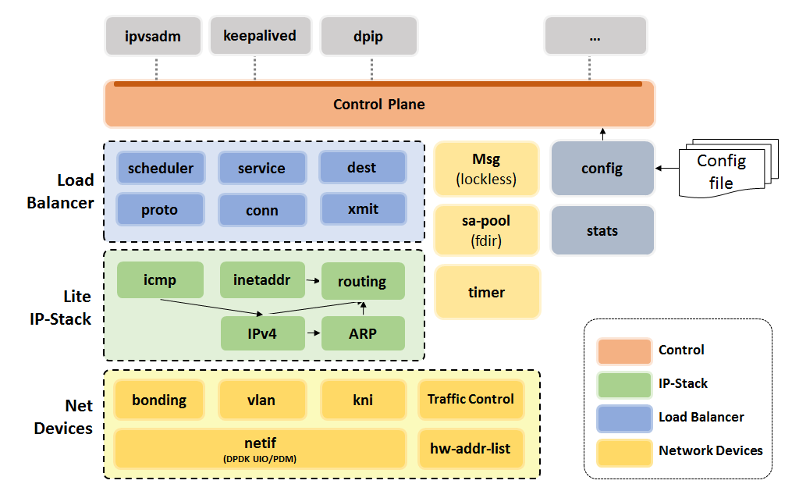
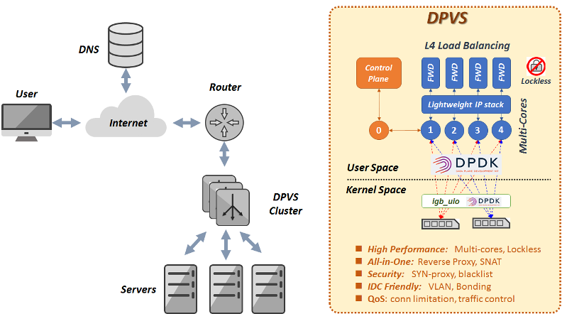

> [Cooper](https://cooper.didichuxing.com/docs2/document/2202486120863) from 晓宇

### Cloudflare Unimog

自研硬件服务器，SDN 架构

可以根据 RS 的负载动态调整连接数量

机房内所有机器都安装了四层 LB，路由器无论把包发给哪台都会转发到正确的 RS 上

优势：

1. LB 不需要做容量规划
2. 最大限度防 DDoS
3. 运维架构简单，所有机器都一样

LB 之间不同步状态，连接保持方案类似 Maglev：所有 LB 自己决定，但保证对于相同的 4-tuple 会转发相同的 RS。所有 LB 都接收由控制平面统一下发的转发表，通过 4-tuple-hash 查表。转发表中每个 RS 可以设置多个 bucket（权重），RS 下线只修改对应 bucket

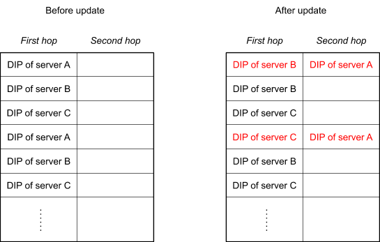

由于没有 ct，它通过备份转发表 (second hop) 方式来继续先前的转发。当一个 RS 机器收到包时，先检查当前机器有没有这个 TCP socket，如果没有就转发到 second hop

> 关于备份转发表存多久的问题，文章作者 kawabangga 问了 cf，解释是：
>   - 删除实例在 Cloudflare 不太常见，更常见的是短暂移除，reboot，然后回到集群，几乎所有的机器每月都会重启一次，所以每一个连接在 24 小时之内都有 1/30 的几率被 reset
>   - 如果要移除的话，如文中所说，会进入到 drain state，在备表中，这个状态只会维持几分钟
>   - 简单来说，连接可以归为两类：short-lived 和 long-lived。几分钟足够所有 short-lived  连接结束了，剩下的都是 long-lived，如果 drain 状态  30min，可能会有部分连接正常结束，但是不会很多，大部分超过几分钟的连接会存在数小时甚至数天，继续等待也不会带来更多显著受益，但是会让操作效率大大降低，所以只等待几分钟

### GitHub GLB


「转发过程」

1. 根据 hash 查找转发表，找到对应的 2 个 RS，一个是主 RS 一个是备 RS，然后转发到主 RS
2. 主 RS 收到包之后，检查这个包是不是属于自己机器上的连接，如果是，就交给协议栈处理，如果不是，就转发到备 RS（备 RS 的地址记录在 GLB 发过来的包中）

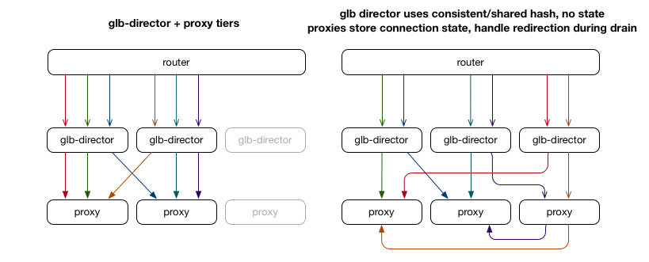

「转发表」

* 在 RS 修改的时候，只有变化的 RS 在表中会修改，没有变化的 RS 在表中的位置不变。即不能对整个表完全重新 hash
* 表的生成不依赖外部的状态
* 每一行的两个 RS 不应该相同
* 所有 RS 在表中出现的次数应该是大致相同的（负载均衡）

实现方式是类似 Rendezvous hashing：对于每一行，将行号 + RS IP 进行 Hash 得到一个数字，作为“分数”，所有的 RS 在这一行按照分数排序，取前两名，作为主 RS 和 备 RS 放到表中。然后按照以下的四个条件来分析：

* 如果添加 RS，那么只有新 RS 排名第一的相关的行需要修改，其他的行不会改变
* 生成这个表只会依赖 RS 的 IP
* 每一行的两个 RS 不可能相同，因为取的前两名
* Hash 算法可以保证每一个 IP 当第一名的概率是几乎一样的

不过要注意的是：在想要删除 RS 的时候，要交换主 RS 和 备 RS 的位置，这样，主 RS  换到备就不会有新连接了，等残留的连接都结束，就可以下线了；在添加 RS 的时候，每次只能添加一个，因为如果一次添加两个，那么这两个 RS 如果出现在同一行的第一名和第二名，之前的 RS 就会没来得及 drain 就没了，那么之前的 RS 的连接都会断掉

 

**优势：**

1. 提供第二选择
2. 不需要保存数据
3. GLB 实例可以和 RS 同时做变化

**问题：**

1. 要动 RS

 

### Google Maglev

DSR 转发模式，Maglev 不会做 NAT，通过 GRE 将二层包封装进 IP 包里（需要 MSS 预留空间）

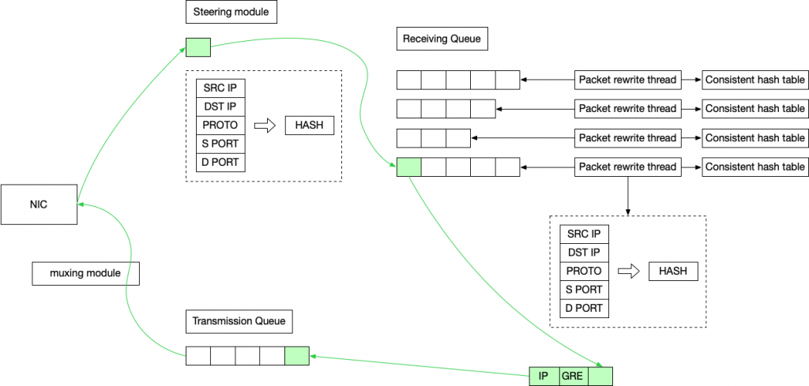

上图是包的转发流程，绿色的是包经过的路径

 

## Reference

> 部分参考

* [一致性哈希算法 - 问题的提出 - 哈希环法 - 跳跃一致性哈希法 - Maglev 一致性哈希法](https://writings.sh/post/consistent-hashing-algorithms-part-1-the-problem-and-the-concept)
* [Consistent Hashing: Algorithmic Tradeoffs 一致性哈希：算法权衡](https://dgryski.medium.com/consistent-hashing-algorithmic-tradeoffs-ef6b8e2fcae8#890d) 和 [libchash](https://github.com/dgryski/libchash)
* [一致性哈希汇总](https://developer.aliyun.com/article/1629452)
* [ketama (源码)](https://github.com/RJ/ketama)
* [Jump Consistent Hash 算法](https://luyuhuang.tech/2021/06/13/jump-consistent-hash.html)
* [A Fast, Minimal Memory, Consistent Hash Algorithm (论文)](https://arxiv.org/abs/1406.2294)
* [Multi-Probe Consistent Hashing (论文)](https://arxiv.org/abs/1505.00062)
* [Maglev: A Fast and Reliable Software Network Load Balancer (论文)](https://research.google/pubs/maglev-a-fast-and-reliable-software-network-load-balancer/)
* [AnchorHash: A Scalable Consistent Hash (论文)](https://arxiv.org/abs/1812.09674)
* [AnchorHash (源码)](https://github.com/anchorhash/cpp-anchorhash)
* [DxHash: A Scalable Consistent Hashing Based on the Pseudo-Random Sequence (论文)](https://arxiv.org/pdf/2107.07930)
* [Rendezvous hashing 算法介绍](https://cloud.tencent.com/developer/article/2327298)
* [Rendezvous Hashing Explained (原文)](https://randorithms.com/2020/12/26/rendezvous-hashing.html)
* [Rendezvous Hashing 源码和实验对比](https://github.com/clohfink/RendezvousHash)
* [Rendezvous Hashing 基于骨架的分层会合散列 O(logN) 优化](https://en.wikipedia.org/wiki/Rendezvous_hashing#O(log_n)_running_time_via_skeleton-based_hierarchical_rendezvous_hashing)
* [LSH 位置敏感哈希入门](https://randorithms.com/2019/09/19/Visual-LSH.html)
* [Consistently Faster: A survey and fair comparison of consistent hashing algorithms](https://amosbrocco.ch/pubs/paper03.pdf)
* [四层负载均衡漫谈](https://www.kawabangga.com/posts/5301)
* [「Bilibili」RPC 负载均衡算法的演进之路](https://mp.weixin.qq.com/s/1U_XSqaGCcbsmGpW2DoVHQ)
* [「美团」MGW——美团点评高性能四层负载均衡](https://tech.meituan.com/2017/01/05/mgw.html)
* [「华为云」配置会话保持提升访问效率](https://support.huaweicloud.com/usermanual-elb/elb_ug_jt_0004.html)
* [「阿里云」负载均衡调度算法介绍](https://www.alibabacloud.com/help/zh/slb/product-overview/introduction-to-load-balancing-scheduling-algorithm)
* [「Nginx」Nginx 源码](https://github.com/nginx/nginx) 和 [Nginx SWRR Commit](https://github.com/nginx/nginx/commit/52327e0627f49dbda1e8db695e63a4b0)
* [「LVS」LVS WRR](https://kb.linuxvirtualserver.org/wiki/Weighted_Round-Robin_Scheduling)
* [「爱奇艺」DPVS (源码)](https://github.com/iqiyi/dpvs)
* [「Cloudflare」Unimog - Cloudflare’s edge load balancer](https://blog.cloudflare.com/unimog-cloudflares-edge-load-balancer/)
* [「GitHub」GLB: GitHub’s open source load balancer](https://github.blog/engineering/glb-director-open-source-load-balancer/) 和 [GLB 源码](https://github.com/github/glb-director)
* [「Google」四层负载均衡分析：Google Maglev](https://www.kawabangga.com/posts/5759)
