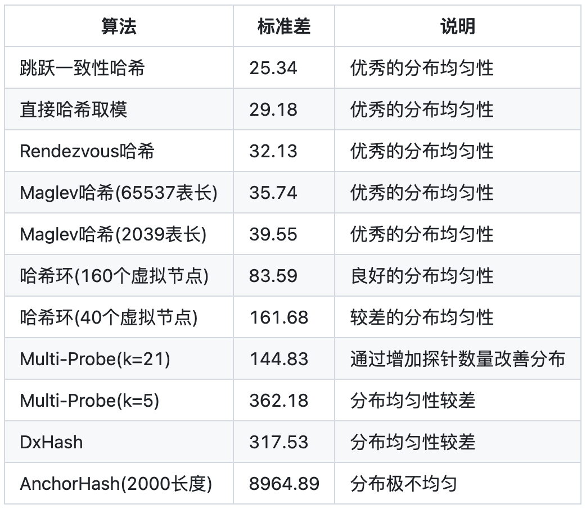
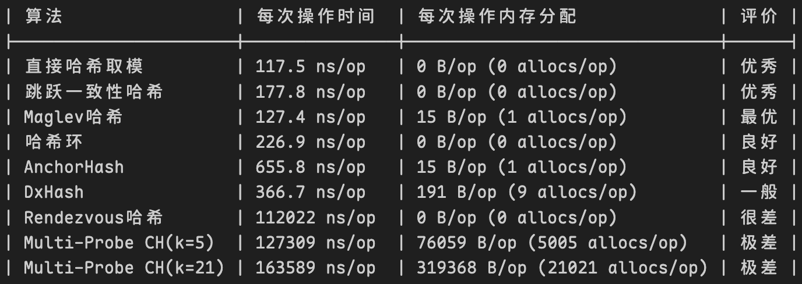
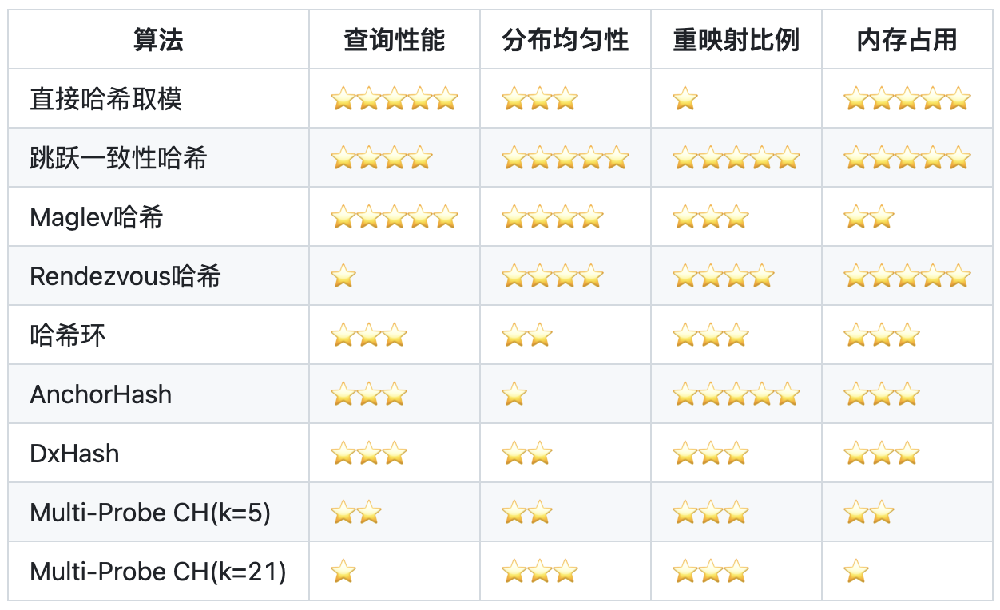

---
# You can also start simply with 'default'
theme: seriph
# random image from a curated Unsplash collection by Anthony
# like them? see https://unsplash.com/collections/94734566/slidev
background: https://cover.sli.dev
# some information about your slides (markdown enabled)
title: Fair in LB
info: |
  ## LB 算法学习分享
# apply unocss classes to the current slide
class: text-align-left
# https://sli.dev/features/drawing
drawings:
  persist: false
# slide transition: https://sli.dev/guide/animations.html#slide-transitions
# transition: slide-left
transition: view-transition
# enable MDC Syntax: https://sli.dev/features/mdc
mdc: true

# open graph
# seoMeta:
#  ogImage: https://cover.sli.dev
---

# LB 算法学习分享

> <h3><center>何为公平？</center></h3>

<br>

<div grid="~ cols-2 gap-4">
<div>

- 角度
  - Client - LB - RS
- 差异
  - RS 性能 / 连接状态 / ...
- 场景
  - 扩缩容 / 跨地域 / ...

...

</div>
<div>

怎么判断现在谁更有能力或更能及时处理？
- 当前 CPU 负载
- 已有的连接数量
- 网络连接空闲状态
- 「发散」服务器主动接收（或任务窃取）

</div>
</div>

<!--
首先，很不好意思耽误大家休息时间来听我分享这个。因为内容比较多，有些地方理解起来也比较费劲，一些算法我自己理解也废了很大劲。我尽量把这些算法的核心思想抽离出来让它更容易听懂一点。在过程中大家有遇到想问的问题可以直接打断我。希望我讲的这个能帮助大家拓展一些思路。大家可以访问:3030来自己浏览

我觉得，LB 算法就是一个一直在讨论公平性的问题
我们会需要从不同的角度看待问题：client 要看自己能不能及时访问到服务、LB 要看自己怎么分配、RS 要一直有能力能及时处理

服务中会面临各种差异：RS 之间性能有差异、当前已有的连接不一样、甚至有的实现里 LB 集群内也会有差异

要考虑不同的场景：业务不是固定不变的、LB 也可能根据需要扩容、有的厂商的实现里还需要考虑跨地域等等问题

应该说 LB 算法之间没有绝对的好坏之分，而是根据场景需求选择最合适的方法。
所以我们在看待 LB 算法的时候也需要一直考虑，什么是公平的？

当然，比较好的方式是评估哪台服务器有能力继续及时的处理请求，我们可以通过一些方式或指标来评判谁当前更有能力或更能及时的进行处理，将下一个新连接交给它。怎么判断谁现在更有能力或更能及时处理呢？
* 当前 CPU 负载
* 已有的连接数量
* 网络连接空闲
* [发散] 服务器主动提出想要接收 (或任务窃取)
-->

---

# 基础公平

<br>

> <h3><center>雨露均沾</center></h3>

<br>

* RR (Round Robin, 轮询)

按照所有 rs 组成的队列，遍历的选择下一个还未调度的 RS，保证了最基础的调度公平但不考虑任何可能的差异

<br>

Real Server: A | B | C

|    i   | 0 | 1 | 2 | 3 | 4 | 5 | ... |
| ------ | - | - | - | - | - | - | --- |
| select | A | B | C | A | B | C | ... |

<!--
最简单来讲，不考虑任何可能的差异，我们只需要轮询的转发给所有的后端服务器即可，保证每个服务器雨露均沾

就像下面的调度结果一样，所有 RS 都会按顺序排队拿到下一个新连接

这保证了最基础的调度公平

但是事实上，这没有考虑过 RS 之间本身会存在性能差异，也没有动态去感知当前的状态差异
-->

---

# 从服务器间存在差异的角度

<br>

<h3><center>收集 RS 还有多少任务要处理</center></h3>

<br>
<center>or</center>
<br>

<h3><center>持续统计所有 RS 的 CPU 占用率</center></h3>

<v-click>
<br>
<center>or</center>
<br>

<h3><center>由 RS 性能来定义权重 ✅</center></h3>

<br>

权重需要动态可调。对业务来说，新上线的 RS 可以自行动态的由低到高的缓慢修改其权重来实现预热等一些需求，或是新增 RS 的权重相应拉高来保证它在开始时有更多的任务去处理来快速分担其他 RS 的压力等

</v-click>

<!--
所以我们要开始考虑RS之间的差异

相比于收集 RS 还有多少任务要处理，或是持续统计所有 RS 的 CPU 占用率这样的方式，肯定是直接由 RS 性能来定义权重最为简单高效

权重是需要动态可调的。对业务来说，新上线的 RS 可以自行动态的由低到高的缓慢修改其权重来实现预热等一些需求，或是新增 RS 的权重相应拉高来保证它在开始时有更多的任务去处理来快速分担其他 RS 的压力等
-->

---

# (I)WRR

<div grid="~ cols-2 gap-4">
<div>

* WRR (Weighted Round Robin，加权轮询)

批量的将与权重数量相当的包直接转发给选择的 RS

Queue Level
</div>
<div>

* IWRR (Interleaved WRR，交错的加权轮询)

轮询选择，权重减一，若其当前权重到 0 就直接跳过

Packet Level
</div>
</div>

```c [LVS WRR (反向 IWRR)] {all|2|6|4|11-12|all}
while (true) {
    i = (i + 1) mod n;    // i: initialized with -1
    if (i == 0) {
        cw = cw - gcd(S); // cw: current weight
        if (cw <= 0) {
            cw = max(S);  // max: get the maximum weight of all servers
            if (cw == 0)
              return NULL;
        }
    } 
    if (W(Si) >= cw) 
        return Si;
}
```

<!--
传统的 WRR 是以队列的层面看待，相当于为每个 RS 开辟一个发送队列，批量的将与权重数量相当的包直接转发给选择的 RS。它的好处也是可以批量处理，但是这对 DGW 来说没有必要
简单的改进是以单个数据包的层面进行划分。对每个数据包来说选择当前权重最大的 RS 进行转发并更新其当前权重

IWRR 尽量强调了轮询的处理，保证调度初期是以轮询的方式选择，直到其当前权重到 0 就直接跳过

下面是LVS中的WRR实现，它可以看作是反向的IWRR（先保证权重差异，后轮询）

i初始化-1开始遍历，每一整轮获取最大权重作为阈值，每一小轮减掉最大公约数，最后向大于阈值的RS转发
-->

---

# (I)WRR

<div grid="~ cols-2 gap-4">
<div>

* WRR (Weighted Round Robin，加权轮询)

批量的将与权重数量相当的包直接转发给选择的 RS

Queue Level
</div>
<div>

* IWRR (Interleaved WRR，交错的加权轮询)

轮询选择，权重减一，若其当前权重到 0 就直接跳过

Packet Level
</div>
</div>

问题：权重差
1. WRR 的权重配置中如果出现相差较多的权重差，就会导致<b>某一段时间里做出连续相同的调度选择</b>。这对 LB 来说是比较致命的，从 RS 的角度考虑，这一台较高会在短时间内打入大量的新连接 -> 平滑处理，打散高权重的连续调度
2. 一整轮调度中间的权重更新会导致重新开始的调度，从更长的时间线上看会加剧连续调度的问题 -> 权重延迟更新，只更新 RS 权重但不修改当前权重值，会使得新权重在下一轮才会被感知到

<!--
它的问题也是因为权重差。当配置中RS之间的权重差异较大，就会导致它在某一段时间内连续的转发到相同的RS，这对LB来说比较致命。因为RS可能会因为连续的调度导致积压甚至直接打崩掉

另一点也可以看作是好处：当有权重更新时我们无需立刻重新开始这一整轮的调度，可以延迟到下一轮再感知新的权重值
-->

---

LVS WRR 调度顺序模拟

```c {all|9|all}
while (true) {
    i = (i + 1) mod n;    // i: initialized with -1
    if (i == 0) {
        cw = cw - gcd(S); // cw: current weight
        if (cw <= 0) {
            cw = max(S);  // max: get the maximum weight of all servers
        }
    } 
    if (W(Si) >= cw)      // Weight: A(1) | B(5), GCD(1)
        return Si;
}
```

|    i   | 0 | 1 | 0 | 1 | 0 | 1 | 0 | 1 | 0 | 1 | 0 | 1 | ... |
| ------ | - | - | - | - | - | - | - | - | - | - | - | - | --- |
|   cw   | 5 | 5 | 4 | 4 | 3 | 3 | 2 | 2 | 1 | 1 | 5 | 5 | ... |
| select |   | <span v-mark.circle.red="{at: 3}">B</span> |   | <span v-mark.circle.red="{at: 3}">B</span> |   | <span v-mark.circle.red="{at: 3}">B</span> |   | <span v-mark.circle.red="{at: 3}">B</span> | A | B |   | B | ... |

<!--
这里我按照LVS的WRR实现列出了它实际的调度顺序的结果，以两个服务器权重分别为1和5为例，这样GCD是1

可以看到它会连续4次向B服务器做转发
-->

---

# SWRR

* SWRR (Smooth Weighted Round Robin，平滑加权轮询)

目的：打散高权重的连续调度

<br>

需要：配置权重

维护：当前权重、总权重

<br>

对于每一次选择：
1. 选择当前权重最高的 RS 调度
2. 选择的 RS 当前权重减去总权重，加速抹平权重间的差值
3. 为了保证当权权重之和仍然等于总权重，为每个 RS 的当前权重增加其配置权重

<!--
所以为了能平滑的处理服务器之间的权重差异，Nginx提出了SWRR，让高权重的调度结果尽量均匀的分散开

在SWRR中需要所有服务器的配置权重，并维护每一个服务器当前的权重和所有服务器的总权重

每一轮选择时，会找到当前权重最高的RS进行调度，并将它当前权重减去总权重，最后给所有RS的当前权重都增加其配置权重，以此来维持所有RS的当前权重和不变
-->

---
transition: view-transition
---

# SWRR

对于每一次选择：
1. 选择当前权重最高的 RS 调度
2. 选择的 RS 当前权重减去总权重，加速抹平权重间的差值
3. 为了保证当权权重之和仍然等于总权重，为每个 RS 的当前权重增加其定义的权重

RS: A(2) | B(2) | C(6), total_weight(10), GCD(2)

WRR: C C A B C

<style>
  span {
    color: red
  }
</style>
SWRR: <v-click><span>C</span></v-click>

current_weight:
| A | B | C |
| - | - | - |
| 2 | 2 | <span v-mark.circle.red="{at: 1}">6</span> |

<!--
这里我们以三台服务器为例，权重分别为2 2 6
它们的总权重是10，GCD是2

这里我保留了它在WRR调度中的顺序

我们简单过一遍SWRR的平滑调度顺序计算过程
-->

---
transition: view-transition
---

# SWRR

对于每一次选择：
1. 选择当前权重最高的 RS 调度
2. 选择的 RS 当前权重减去总权重，加速抹平权重间的差值
3. 为了保证当权权重之和仍然等于总权重，为每个 RS 的当前权重增加其定义的权重

RS: A(2) | B(2) | C(6), total_weight(10), GCD(2)

WRR: C C A B C

<style>
  span {
    color: red
  }
</style>
SWRR: C

current_weight:
| A | B | C |
| - | - | - |
| 2 | 2 | <span>-4</span> |

---
transition: view-transition
---

# SWRR

对于每一次选择：
1. 选择当前权重最高的 RS 调度
2. 选择的 RS 当前权重减去总权重，加速抹平权重间的差值
3. 为了保证当权权重之和仍然等于总权重，为每个 RS 的当前权重增加其定义的权重

RS: A(2) | B(2) | C(6), total_weight(10), GCD(2)

WRR: C C A B C

<style>
  span {
    color: red
  }
</style>
SWRR: C <v-click><span>A</span></v-click>

current_weight:
| A | B | C |
| - | - | - |
|<span v-mark.circle.red="{at: 0}">4</span> | 4 | 2

---
transition: view-transition
---

# SWRR

对于每一次选择：
1. 选择当前权重最高的 RS 调度
2. 选择的 RS 当前权重减去总权重，加速抹平权重间的差值
3. 为了保证当权权重之和仍然等于总权重，为每个 RS 的当前权重增加其定义的权重

RS: A(2) | B(2) | C(6), total_weight(10), GCD(2)

WRR: C C A B C

<style>
  span {
    color: red
  }
</style>
SWRR: C A

current_weight:
| A | B | C |
| - | - | - |
| <span>-6</span> | 4 | 2 |

---
transition: view-transition
---

# SWRR

对于每一次选择：
1. 选择当前权重最高的 RS 调度
2. 选择的 RS 当前权重减去总权重，加速抹平权重间的差值
3. 为了保证当权权重之和仍然等于总权重，为每个 RS 的当前权重增加其定义的权重

RS: A(2) | B(2) | C(6), total_weight(10), GCD(2)

WRR: C C A B C

<style>
  span {
    color: red
  }
</style>
SWRR: C A <v-click><span>C</span></v-click>

current_weight:
| A | B | C |
| - | - | - |
| -4| 6 | <span v-mark.circle.red="{at: 0}">8</span> |

---
transition: view-transition
---

# SWRR

对于每一次选择：
1. 选择当前权重最高的 RS 调度
2. 选择的 RS 当前权重减去总权重，加速抹平权重间的差值
3. 为了保证当权权重之和仍然等于总权重，为每个 RS 的当前权重增加其定义的权重

RS: A(2) | B(2) | C(6), total_weight(10), GCD(2)

WRR: C C A B C

<style>
  span {
    color: red
  }
</style>
SWRR: C A C

current_weight:
| A | B | C |
| - | - | - |
| -4| 6 | <span>-2</span> |

---
transition: view-transition
---

# SWRR

对于每一次选择：
1. 选择当前权重最高的 RS 调度
2. 选择的 RS 当前权重减去总权重，加速抹平权重间的差值
3. 为了保证当权权重之和仍然等于总权重，为每个 RS 的当前权重增加其定义的权重

RS: A(2) | B(2) | C(6), total_weight(10), GCD(2)

WRR: C C A B C

<style>
  span {
    color: red
  }
</style>
SWRR: C A C <v-click><span>B</span></v-click>

current_weight:
| A | B | C |
| - | - | - |
| -2| <span v-mark.circle.red="{at: 0}">8</span> | 4 |

---
transition: view-transition
---

# SWRR

对于每一次选择：
1. 选择当前权重最高的 RS 调度
2. 选择的 RS 当前权重减去总权重，加速抹平权重间的差值
3. 为了保证当权权重之和仍然等于总权重，为每个 RS 的当前权重增加其定义的权重

RS: A(2) | B(2) | C(6), total_weight(10), GCD(2)

WRR: C C A B C

<style>
  span {
    color: red
  }
</style>
SWRR: C A C B

current_weight:
| A | B | C |
| - | - | - |
| -2 | <span>-2</span> | 4 |

---
transition: view-transition
---

# SWRR

对于每一次选择：
1. 选择当前权重最高的 RS 调度
2. 选择的 RS 当前权重减去总权重，加速抹平权重间的差值
3. 为了保证当权权重之和仍然等于总权重，为每个 RS 的当前权重增加其定义的权重

RS: A(2) | B(2) | C(6), total_weight(10), GCD(2)

WRR: C C A B C

<style>
  span {
    color: red
  }
</style>
SWRR: C A C B <v-click><span>C</span></v-click>

current_weight:
| A | B | C |
| - | - | - |
| 0 | 0 | <span v-mark.circle.red="{at: 0}">10</span> |

---
transition: view-transition
---

# SWRR

对于每一次选择：
1. 选择当前权重最高的 RS 调度
2. 选择的 RS 当前权重减去总权重，加速抹平权重间的差值
3. 为了保证当权权重之和仍然等于总权重，为每个 RS 的当前权重增加其定义的权重

RS: A(2) | B(2) | C(6), total_weight(10), GCD(2)

WRR: C C A B C

<style>
  span {
    color: red
  }
</style>
SWRR: C A C B C

current_weight:
| A | B | C |
| - | - | - |
| 0 | 0 | <span>0</span> |

<!--
最终所有服务器的当前权重回到初始状态，进入下一轮

可以看到相比WRR调度，连续的C中间被插进去了一次A
-->

---

# SWRR

<br>

> 核心逻辑：规律的调整权重但永远保持总权重不变

<br>

问题：调度时间开销 和 相同调度选择
1. 每次调度需要遍历所有的 RS 找到当前权重最大的一个，查找调度**时间开销**为 O(N) 或 O(logN)（如果选择用例如最大堆维护，就需要额外花时间维护堆），更新当前权重 O(N) -> **预先计算**调度顺序，调度时可以直接 O(1) 选择
2. 集群中每一个单机和单机中每一个 WORKER 都会做出**相同的调度选择**，使得从整体上来看（或从 RS 的角度看）LB 集群会做出多次连续重复的调度 -> 调度顺序随机初始位置
3. 其他优化方案参见 Nginx 章节

<!--
SWRR的核心逻辑是：规律的调整权重但永远保持总权重不变。它已经能很好的打散我们在一整轮调度中的连续调度结果

但是，SWRR仍然有一些问题
-->

---

# VNSWRR

* VNSWRR (Virtual Node Smooth Weighted Round Robin，虚拟节点平滑加权轮询)

预先计算好完整的调度顺序表，并在一开始选择随机的 idx 开始调度

LB(5), SWRR: C A C B C

| LB id | random idx | select | select | select | select | select |
| ----- | ---------- | ------ | ------ | ------ | ------ | ------ |
|   0   |     0      |    C   |    A   |    C   |    B   |    C   |
|   1   |     1      |    A   |    C   |    B   |    C   |    C   |
|   2   |     2      |    C   |    B   |    C   |    C   |    A   |    
|   3   |     3      |    B   |    C   |    C   |    A   |    C   |    
|   4   |     4      |    C   |    C   |    A   |    C   |    B   |

<!--
针对前面两条SWRR的问题，阿里提出了利用虚拟节点的SWRR，但是这个虚拟节点和后面一致性哈希的虚拟节点不是同一个意思

VNSWRR的思想是我们提前计算好调度顺序，然后从一个随机的位置开始遍历这个调度顺序

第一行的结果就是我们前面SWRR的调度顺序，通过预先计算，在调度时我们就可以O(1)的查找到这一次的调度结果

表中的每一行代表一台LB单机，假设它5台机器随机的起点都不一样，那么对整个集群来说的调度顺序可能就是在这里走S型的散乱顺序了
-->

---

# VNSWRR

* VNSWRR (Virtual Node Smooth Weighted Round Robin，虚拟节点平滑加权轮询)

预先计算好完整的调度顺序表，并在一开始选择随机的 idx 开始调度

LB(5), SWRR: C A C B C

<br>

从整体的角度看

SWRR: <span v-mark.red.underline="{at: 0}">C C C C C</span> A A A A A C C C C C B B B B B C C C C C

VNSWRR: <span v-mark.red.underline="{at: 0}">C A C B C</span> A C B C C C B C C A B C C A C C C A C B

<!--
这里放了从整体角度看的SWRR和VNSWRR可能的实际调度顺序，可以看到SWRR仍然会有连续的调度结果。如果在过程中还会发生权重变更，那这个连续的调度可能会更夸张
-->

---

# VNSWRR

* VNSWRR (Virtual Node Smooth Weighted Round Robin，虚拟节点平滑加权轮询)

<span v-mark.red="{at: 0}">预先计算</span>好完整的调度顺序表，并在一开始选择随机的 idx 开始调度

<br>
<br>

<v-click>
问题：
<br>
<br>
<ol>
  <li>预先计算的时间开销</li>
  <li>每次做权重修改或发生 RS 扩缩容都需要重新计算</li>
  <li>GCD 优化调度顺序表长度</li>
</ol>
</v-click>

<!--
但是，回来看VNSWRR算法的思想，它需要预先计算好调度顺序表

这也就意味着，我们在预先计算的过程中是不能开始调度的，且每次发生权重修改或是后端服务器扩缩容都需要重新计算这个调度顺序表
-->

---

# VNSWRR

* VNSWRR (Virtual Node Smooth Weighted Round Robin，虚拟节点平滑加权轮询)

<br>

### GCD 优化

调度顺序表的长度取决于总权重，但实际上会以所有 RS 权重的最小公倍数为一轮，所以只需要存放 GCD 后的总权重长度

实际上权重本来就可以除最大公约数进行约分，等效权重

| weight | A | B | C |
| ------ | - | - | - |
| before | 2 | 2 | 6 |
| after  | 1 | 1 | 3 |

<!--
为了尝试缓解这个问题，我们先从GCD优化开始

调度顺序表的长度取决于总权重，但我们知道如果所有RS的权重之间存在最大公约数，那么它们也就等价于所有RS都除掉最大公约数

所以实际的调度顺序表只需要约分之后的总权重即可，在这里就是从10缩小到5，这个比较好理解
-->

---

# VNSWRR - 预计算开销

N: RS number, M: total weight after dividing GCD

```python [伪代码 计算调度顺序表]
M <- count total weight # O(N)
malloc vrs_table with M
for every loop idx(auto increment) in M: # O(M)
  find RS a with max effective weight # O(N)
  RS a effective weight update # O(1)
  update all RS effective weight # O(N)
  vrs_table[idx] = RS a
```

```python [伪代码 调度]
random start index i
for every schedule:
  RS a = vrs_table[i] # O(1)
  i = (i + 1) % M
  # make sure RS a alived
  while RS a is not alived:
    RS a = vrs_table[i]
    i = (i + 1) % M
  return RS a
```

<!--
然后是VNSWRR算法的预计算所需要的时间

我在这里放了它的计算和调度两部分的伪代码。可以看到在计算的循环里，idx只是用来表示在表中下一个记录的位置，和实际的调度计算无关。这也就意味着它是可以随时暂停的
-->

---

# VNSWRR - 预计算开销

N: RS number, M: total weight after dividing GCD

```python [伪代码 计算调度顺序表] {3-|3,7}
M <- count total weight # O(N)
malloc vrs_table with M
for every loop idx(auto increment) in M: # O(M)
  find RS a with max effective weight # O(N)
  RS a effective weight update # O(1)
  update all RS effective weight # O(N)
  vrs_table[idx] = RS a
```

```python [伪代码 调度] {0}
random start index i
for every schedule:
  RS a = vrs_table[i] # O(1)
  i = (i + 1) % M
  # make sure RS a alived
  while RS a is not alived:
    RS a = vrs_table[i]
    i = (i + 1) % M
  return RS a
```

---

# VNSWRR - 预计算开销

N: RS number, M: total weight after dividing GCD

```python [伪代码 计算调度顺序表] {3,7}
M <- count total weight # O(N)
malloc vrs_table with M
for every loop idx(auto increment) in M: # O(M)
  find RS a with max effective weight # O(N)
  RS a effective weight update # O(1)
  update all RS effective weight # O(N)
  vrs_table[idx] = RS a
```

<br>

SWRR 计算过程中可以划分 Step 打散对调度顺序表的计算

$$
O(MN) \to O(Step \times N) \times \frac{M}{Step}
$$

<!--
所以在计算时，我们可以给它划分步长Step，后面的部分以后再来计算。这样表长度M就被分成了M/Step次分开算，只要算完当前Step内的结果就可以开始调度了

那么Step应该设置为多少呢
-->

---

# VNSWRR - 预计算开销


<!--
通过实验可以看到，不同的Step都会随着RS数量增加而花费更多时间，这也和我们前面Step和RS数量N成反比的结论基本一致
-->

---
layout: image-right
image: ./media/image1.png
backgroundSize: 30em 70%
drawings:
  persist: true
---

# VNSWRR - 预计算开销

| rs num | step |
| ------ | ---- |
| <= 200 | 128  |
| <= 300 | 64   |
| <= 400 | 32   |
| more   | 16   |

<br>

100k 纳秒

<arrow x1="520" y1="390" x2="950" y2="390" color="red" width="1" arrowSize="1" />

<!--
我们在100k纳秒（不要问这是多少时间）位置画一条线，意思是控制每个Step的计算时间在这个时间以内，这样保证表计算对调度的时间影响较低。

最终得到了左边的结果
-->

---
drawings:
  persist: true
---

# VNSWRR - 划分 Step 后的随机初始 idx

<br>

划分 Step 也就意味着，随机初始坐标的范围被限制到 \[0, Step) 里了

<br>

随机打乱同 current weight 时的 RS 选择顺序，扩大随机范围

<br>
<br>
<br>
<br>
<br>
<br>

                 0                                  Step

<arrow x1="200" y1="420" x2="850" y2="420" color="blue" width="2" arrowSize="1" />
<arrow x1="500" y1="400" x2="800" y2="400" color="red" width="2" arrowSize="1" />

<!--
但是随之而来的又有一个问题：

原来计算完整调度表的时候可以随便定一个起始位置，现在只计算一个Step了，我们也没法从没计算的部分开始

现在的解决方案是打乱RS链表的顺序，这样在SWRR计算过程中面对相同权重进行选择时，就会有不同的选择结果，从而扩大了随机范围

像下面的图一样，除了本身就能打乱一些调度顺序，在关键节点Step的位置，如果有（大概率）很多个相同当前权重的结果，就意味着随机范围扩大到了红色箭头的右端点的位置

事实上打乱RS顺序的影响还会更大
-->

---

# VNSWRR

问题：分步计算、权重更新和乱序算法

现在的分布计算会在前几次调度时计算下一个 Step 的调度顺序表

[改为 next_idx 快到 next_init_idx 时再计算下一个 Step，打散调度顺序的计算]{style="color: white"}

```python [伪代码 调度] {all|2,4-6}
random start index i in (0, Step)
next init idx j = Step
for every schedule:
  if j < M:
    calculate next Step
    j += Step
  RS a = vrs_table[i] # O(1)
  i = (i + 1) % M
  # make sure RS a alived
  while RS a is not alived:
    RS a = vrs_table[i]
    i = (i + 1) % M
  return RS a
```

<!--
当然，VNSWRR也并非完美

首先，在我们当前的实现里，会在前几次调度时查看并计算还未计算的Step。这其实会影响前几次调度的延迟。假设放大到所有WORKER、整个LB集群，就不是很优雅的分布计算方案了
-->

---

# VNSWRR

问题：分步计算、权重更新和乱序算法

现在的分布计算会在前几次调度时计算下一个 Step 的调度顺序表

改为 next_idx 快到 next_init_idx 时再计算下一个 Step，打散调度顺序的计算

```python [伪代码 调度] {4-6}
random start index i in (0, Step)
next init idx j = Step
for every schedule:
  if j == i:
    calculate next Step
    j += Step
  RS a = vrs_table[i] # O(1)
  i = (i + 1) % M
  # make sure RS a alived
  while RS a is not alived:
    RS a = vrs_table[i]
    i = (i + 1) % M
  return RS a
```

<!--
因为我们做分步计算存储了额外的next_init_idx指针，实际上可以改为在当前已经计算完的调度顺序表用完的时候再去计算下一个Step的结果，这样再加上我们一开始随机的起点位置，能更好的打散调度顺序计算的影响

并且考虑到可能会有的变化导致的重新计算，这也能尽量少的进行无效的调度顺序计算
-->

---

# VNSWRR

问题：分步计算、权重更新和乱序算法

<br>

每次有 RS 的权重更新都会导致调度顺序表需要重新计算。如果有频繁的权重更新，会使得调度顺序表的计算开销被放大

<br>

<div v-click>
<ul>
<li>问题1的解决方案能部分保证不会连续的计算 Step 内调度顺序</li>

<li>调度顺序的计算现在放在 CTRL 线程，因读写锁与 WORKER 的调度互斥，改为 RCU 机制使计算时的调度可以继续用旧的调度顺序表来做调度选择？</li>

<li>全局完整的调度顺序表计算（CTRL 线程），WORKER 本地只随机 next_idx in [0, M)？</li>
</ul>
</div>

<!--
前面就是刚才的解决方案

然后我们想一定程度上解开写锁对调度时用的读锁的影响。是不是可以让调度继续用之前的调度顺序表，毕竟它对一致性要求不高，所以考虑RCU方式的调度顺序表更新

在这个基础上就会想，是不是可以干脆直接把整个调度顺序表都计算完，反正它不阻塞调度的读。这样只需要全局唯一的计算一个调度顺序表，每个WOKER只需要维护自己本地的 next_idx 即可，且它的随机范围可以扩大到整个表长度

这其实所有预先计算的方式的通病。只要修改了权重或者说有 SVC RS 更新就需要重新计算调度顺序表
-->

---

# VNSWRR

问题：分步计算、权重更新和乱序算法

<br>

当前的乱序算法是将所有 RS 以随机顺序挨个添加到新的临时链表里，$O(N^2)$


<div v-click>

参考洗牌算法 `BV1tNKfz1Eqc`

  1. 每张牌给随机值，按照随机值排序，时间 O(NlogN)，空间 O(N) 但可以和 Maglev 一致性哈希共用偏好数组
  2. 新版 Fisher-Yates 算法：依赖数组 O(1) 取值。维护牌堆数组的洗好和未洗两部分，每次将未洗的最后一张牌 last_idx 与随机未洗位置 random_idx (0 ~ last_idx) 的牌 O(1) 交换，并将最后一张 last_idx 当作洗好的部分。最终可以 O(N) 时间随机洗牌。但需要额外存储一个 RS 数组用来取 random_idx

<br>

<arrow x1="300" x2="600" y1="440" y2="440" color="blue" width="2" arrowSize="1" />
<arrow x1="500" x2="600" y1="430" y2="430" color="red" width="2" arrowSize="1" />
<arrow x1="340" x2="340" y1="480" y2="440" color="grey" width="1" arrowSize="1" />
<arrow x1="500" x2="500" y1="480" y2="440" color="grey" width="1" arrowSize="1" />

</div>

<!--
然后是乱序算法。这里只考虑打乱RS顺序的问题

在当前的实现里，需要以随机顺序添加到新的临时链表中，时间O(N^2)

我偶然间在b站上看到了一个介绍洗牌算法的视频，顾名思义洗牌算法就是想解决二维的乱序问题

第一种方案是随机值排序，时间可以压缩到 O(NlogN)，但我们就需要额外的空间来记录随机值结果

第二个是 Fisher-Yates 算法，图中蓝色代表完整的RS列表，红色代表以乱序的部分。从右向左遍历，将当前位置的RS与前面随机位置的RS交换，然后添加到已乱序部分。这显然依赖数组的O(1)存储，但最终能实现O(N)时间的打乱顺序
-->

---

# 不同的 WRR 算法对比

| | | |
| ---------------------------- | ------------------------------------------------------------ | ------------------------------------------------------------ |
| (I)WRR (Packet number level) | 循环调度**周期短**<br />实现简单，维护信息少<br />**权重延迟更新** | **权重差值**大连续调度|
| SWRR (Packet level)          | **平滑**解决连续问题 | <b>O(N)</b>调度<br />**相同序列**调度压力 |
| VNSWRR (RS level)            | 预先计算，**O(1)** 调度<br />**打散**重新计算时的流量<br />**分步**更新减缓计算开销 | **不共享**，单独计算<br />next_idx **随机范围**不是完整的调度顺序表长度 |

<!--
简单对比一下不同的WRR算法

IWRR比较简单，并且能保证一定程度的简单轮询，但是有权重差值导致连续调度的问题

SWRR在单WORKER里实现了平滑，但调度开销大、整体不平滑

VNSWRR通过预先计算和随机起点解决了SWRR的问题，但也就意味着它不好应对变化且会卡住调度。且因为不共享造成了额外的开销
-->

---

# 从服务器连接状态的角度

<br>

相比于预定义的权重信息，统计当前的连接状态可以更灵活的处理 RS 的调度选择问题

因为 LB 以集群方式部署，本身从 RS 上收集会更能表示其真实的已有的连接状态，但是需要改造 RS 以例如 Sidecar 模式额外的收集信息且对 RS 造成了额外的开销。对 DGW 更合适的方式是在自己集群内进行全局的统计

* minConn (最小连接数)

维护对所有 RS 的连接数统计，每次选择当前连接数最少的 RS 调度

通过维护连接数最小堆的方式 O(1) 的选择调度并 O(logN) 的维护

* 由于 WORKER 之间不共享，需要额外的定时任务来收集所有 WORKER 的连接数信息更新到每一个 WORKER 本地，且面对大量的连接数更新，直接重建堆
* 由于集群内不共享，需要依靠会话同步的方式来获取其他机器的连接数统计

<!--
我们在测试性能的时候，通常会有三个指标：PPS（包）、CPS（连接数）、BPS（带宽）。前面的都是从数据包（连接）层面上看调度，现在我们从服务器连接状态的角度看LB

...

维护对所有 RS 的连接数统计（借会话同步来收集其他 DGW 机器上的连接数信息），每次选择当前连接数最少的 RS 调度。通过维护连接数最小堆的方式 O(1) 的选择调度并 O(logN) 的维护。但是由于 WORKER 之间不共享，需要额外的定时任务来收集所有 WORKER 的连接数信息更新到每一个 WORKER 本地，且面对大量的连接数更新，直接重建堆；由于集群内不共享，需要依靠会话同步的方式来获取其他机器的连接数统计
-->

---

# minConn

<br>

问题：
1. 不是从 RS 收集的真实连接数，无法感知其他连接
2. 维护非常麻烦，集群内、WORKER 间 收集，最小堆维护和定时重建
3. 集群内会话同步通常只收集长连接，面对大量持续建立的新短连接没有办法建立全局视野
4. 单纯的 minConn 调度时不会考虑 RS 的权重分配，建立连接时只会将本 WORKER 连接数 + worker_cnt

---

# minConn

<br>

问题：
1. 不是从 RS 收集的真实连接数，无法感知其他连接
2. 维护非常麻烦，集群内、WORKER 间 收集，最小堆维护和定时重建
3. 集群内会话同步通常只收集长连接，面对大量持续建立的新短连接没有办法建立全局视野
4. 单纯的 minConn 调度时不会考虑 RS 的权重分配，建立连接时只会将本 WORKER 连接数 + worker_cnt

W-minConn 带权重的最小连接数判断

* 建立连接时连接数 $+\space worker\_cnt \times weight$，统计时也直接计算 $conn\_cnt \times weight$ 来建堆（注意这里"权重"越低，"权重"越高 :)
* 除权重后向上取整
* 两两对比时，$conn_A \times weight_B > conn_B \times weight_A$

<!--
Nginx直接采用两两对比，不建堆的方案，O(N)调度
-->

---

# 从数据包间存在长短差异的角度

数据包之间会有长短（尽管这在 DGW 认为是一致的），它可能影响的更多是收发包的时间开销

参考上一章的权重分配，这里将数据包的大小作为权重的影响因素。刚发送了长数据包的 RS 不应成为下一次的选择

* DWRR (Deflicit Weighted Round Robin，赤字轮询)

赤字计数器表示此轮可以发送的最大字节数，如果其大于等于数据包大小则此轮可以发送（并将计数器减掉数据包大小），否则放到下一轮考虑

赤字计数器每轮均等增加或按照权重配置增加。对应到 DGW 是为所有 RS 维护赤字计数器，每轮增加权重值，并选择下一个计数器值大于数据包大小的 RS 调度

| Packet | w | RS | curr | curr | curr |
| ------ | - | -- | ---- | ---- | ---- |
|   6    | 2 | A  |  2   |  4   |  4   |
|        | 4 | B  |  4   |  8   |  2   |

<!--
然后我们来考虑BPS。数据包之间会存在差异，或者说是 RS 网卡承受不了的数据长度（buffer 不够导致丢包）

假设 RS 正在大量收包甚至接近超过处理能力范围，RS 的收包成为瓶颈。因为我们现在 LB 只考虑新连接调度，所以只做简单介绍

假设我们会收集所有收到并转发的数据包长度信息。DWRR可以看作是把数据包大小当作权重的一部分。当前权重代表阈值，每轮递增，直到超过数据包大小

下面的表格列了一个6大小的数据包在两台 2 4 权重的服务器间的DWRR过程。在这里直到B的当前权重达到8，超过了数据包大小后，才被选择将数据包发送给B服务器，并更新当前权重
-->

---

# 从完全随机的角度

<br>

通过哈希的方式可以保证相同的明文值每次都会哈希为相同的密文（幂等性），额外的保证
* 相同的 QUIC CID 转发到相同的 RS 进行处理
* 新连接依靠相同的 hash key 打回与上一次连接相同的 RS（天然的会话保持能力）

**公平性**依靠哈希算法的**散列程度**

<br>

* Hash % Mod

根据某一个特定的值进行哈希（随机打散），再对 RS 数量取模

DGW 本身存储 RS 是以链表和哈希桶的方式，需要再额外以数组形式存储调度顺序表以保证 O(1) 的调度选择

<!--
除了有规律的调度，我们也可以把一切交给天命。哈希的公平性依靠哈希算法的散列程度

哈希的好处是不需要记录状态，每个新连接根据数据包里的信息来选择调度即可，所以一定程度上哈希可以保证相同的标记会转发到相同的RS

最简单的可以想到，对关键字哈希后直接取模RS数量就可以建立到RS的映射。但是由于LB存储都是链表形式，需要额外的数组来保证O(1)的调度选择
-->

---

# Hash % Mod

<br>

调度公平的影响因素为哈希算法和 RS 数量

1. 首先需要保证哈希明文的唯一和哈希结果尽量分散，尤其当 RS 数量较少的时候，若再遇到哈希碰撞就会导致很明显的调度不均
2. RS 数量变化会导致之前哈希的结果都发生改变

RS number: $m(4) \to n(5)$

不变的映射为: 0, 1, 2, 3, 20, 21, 22, 23, ...

LCM(Least Common Multiple)，最小公约数

$$
\frac{min(m, n)}{LCM(m, n)}
$$

<!--
但是，由于我们是对RS数量取模，那么这种方式对RS数量就会很敏感

RS数量少时，很容易出现调度不均的情况

当RS数量发生变化时，例如从4台增加到5台服务器，之前哈希后的值建立的映射就只有每20中4个不改变了。比例与前后RS数量的最小公约数有关，公式表示为
-->

---

# Hash % Mod

<br>

调度公平的影响因素为哈希算法和 RS 数量

1. 首先需要保证哈希明文的唯一和哈希结果尽量分散，尤其当 RS 数量较少的时候，若再遇到哈希碰撞就会导致很明显的调度不均
2. RS 数量变化会导致之前哈希的结果都发生改变

解决方案：

1. 填充虚拟节点，增加槽位
2. 一致性哈希降低重新映射的数量

K: number of keys, n: number of slots，槽位改变平均只需要重新映射

$$
\frac{K}{n}
$$

<!--
一致性哈希提出就是为了解决哈希取模的问题，降低RS变化时重新映射的比例，并尽力解决分配均匀的问题

通常我们定义，一致性哈希的槽位改变只需要重新映射 K/n 的部分，但是一些一致性哈希算法也只能尽量控制重映射的数量少。在一些一致性哈希算法中，通过虚拟节点的方式来保证RS数量不会太少
-->

---

# Consistent Hash 一致性哈希

<br>

1. **Load Balancing 均衡**

每一个 RS 获取任何一个 key 的机会均等

<br>

2. **Minimal Disruption/Remapping 最小化重映射**

$$
\frac{K}{n}
$$

1. 对于新增 RS，已有的 key 映射不变或重映射到新 RS，且总的重映射可控
2. 对于删除 RS，已有映射到非此 RS 的映射不变，映射到此 RS 的分散给其他 RS

<br>

> 哈希范围通常不能和可变值绑定

<!--
这里指出在大多数论文中对一致性哈希的要求

在负载均衡上，它要求每一个RS获取任何一个key的机会均衡

在最小化重映射上，对于新增RS。。。
对于删除RS。。。

总结来说，通常情况下哈希范围不能与可变值绑定
-->

---

# Consistent Hash 一致性哈希

<br>
<br>

<div style="margin: auto 30%;">

* 哈希环（割环法） - 1997
* Jump Hash 跳跃一致性哈希 - 2014
* Multi-Probe 一致性哈希 - 2015
* Maglev 一致性哈希 - 2016
* AnchorHash 一致性哈希 - 2020
* DxHash 一致性哈希 - 2021

<br>
<br>

* Rendezvous 哈希 - 1997

</div>

<!--
这里按照时间顺序整理了一些较为通用或较新的一致性哈希算法（最后一个Rendezvous哈希比较特殊）
-->

---

## Rendezvous 哈希

<!--
rendezvous 约会，和所有 RS 约会一遍，然后挑最喜欢的那个的渣男行为
-->

<br>

「核心思想」

如果只是对服务器ID进行哈希，那么当修改服务器的数量时，所有的哈希值都会发生变化。当对目标服务器的选择和服务器的数量没有直接关系时，就可以避免服务器的增删带来的影响

<br>

「算法思路」

为每个 key 生成一个随机有序的服务器列表，并选择列表中的第一个作为目标服务器

如果选择的第一台服务器下线时，只需要将 key 转移到列表中的第二台服务器并作为新的第一台服务器即可

1. 对每个服务器计算 key:rs_id 哈希来生成一组整数哈希值
2. 基于该哈希值对服务器进行排序，得到一个随机排列的服务器列表

对于有权重分配的场景，可以基于 $w \div lnh(x)$ 排序，$h(x)$ 哈希范围在 $[0, 1]$

<!--
先来看Rendezvous哈希。Rendezvous这个词意思是约会，这个算法的实际含义是：和所有RS都约会一遍，然后确定那个最好的。所以它是渣男算法

为了和RS数量解耦，Rendezvous会为每个key生成一个随机有序的RS序列，并选择第一个RS作为目标。和RS的约会过程就是把key自己和RS id合起来进行哈希得到一个随机值，然后把所有RS的随机值进行排序

对于想要分配权重的场景，可以用权重除来作为选择的影响因子
-->

---

## Rendezvous 哈希

<br>

优势：

1. 将服务器选择**和数量完全解绑**，并提供了第二选择服务器，解决了哈希级联故障转移的问题
2. 没有额外的**内存存储开销**

<br>

问题：调度的时间开销和扩容影响第一选择

1. 调度时需要对所有 RS 进行哈希计算并排序，时间开销 O(NlogN)。实际上在取 RS 哈希时应该先检查存活，所以只需要 **O(N)** 查找哈希值最大的一个即可
2. 扩容时新服务器可能成为一些已有 key 的第一选择，所以**很难维护第一选择的不变**。在分布式存储场景下需要重新校验所有 key，但在缓存和负载均衡场景下影响可以接受

<!--
当渣男的好处就是完完全全的解耦，调度和RS完全无关。并且当排第一的RS有问题时，它可以继续向后选择备胎

并且它不需要记录任何内容，每个key来了现场计算一遍就可以

相应的，计算和排序开销就需要考虑，会花费O(NlogN)的时间。但是实际上通常只需要拿第一个，并且可以将存活检查也放到这一步里，所以O(N)的遍历找最大即可

另一点是扩容时会影响一些key的第一选择，但是如果我们不在乎保持的话也是可以接受的
-->

---

## Rendezvous 哈希

<br>

「变体」调度时间优化至 **O(logN)**

把原始节点分成若干个虚拟组，虚拟组一层一层组成一个“骨架”，然后在虚拟组中按照 Rendezvous 哈希计算出最大的节点，从而得到下一层的虚拟组，再在下一层的虚拟组中按同样的方法计算，直到找到最下方的真实节点

<center>
  
</center>

<!--
后来又提出了类似跳表的优化方案，通过建立层级关系，我们可以像这里动图这样O(logN)的时间找到对应的RS，但这样也就意味着需要维护层级关系了
-->

---

## Rendezvous 哈希

<br>

「扩展思考」

不要对每一个 RS 都计算哈希，直接对 key 哈希后切分得到有序的服务器列表

切分时为了和 RS 数量解耦，需要按照固定的长度切分，如 8 bits 为一组进行映射（即 RS 最多 256 个），但就会面临大量的 hash_val 无法映射到节点的问题

->

DxHash 一致性哈希

<!--
借鉴Rendezvous哈希的思想，但是又不想对每一个RS都单独计算一遍，当时就想到说是不是可以把key哈希后直接按固定的长度切分，直接得到Rendezvous哈希的RS序列

比如RS限制在最多256个，那么我们就可以按照8bits一组进行切分得到序列，但是这就会面临大量哈希结果找不到节点的问题

后来发现，这其实基本也就是DxHash算法了
-->

---
layout: image-right
image: ./media/DxHash.png
backgroundSize: 30em 100%
---

## DxHash 一致性哈希

<br>

NSArray 是长度为大于 RS_num 的最小 $2^{n}$ 值，例如 RS 4 台，NSArray 长度则为 8

通过伪随机数机制来保证同一个 key 有固定有序且无限长度的服务器序列

> Minimal Disruption: the changed node is either the original or the destination of the remapped keys.

为了防止无限长的服务器序列但一直映射不到活动节点，DxHash 对搜索的次数限制到 8n，n 为 cluster size

$$
P = (\frac{n - 1}{n})^{8n}
$$

当 n 足够大，P 接近 $\frac{1}{e^8}$，约为 0.03%，作者认为概率足够小

<!--
DxHash是这里面最新的一个算法，大概在21年最早提出，在23年（两年前）才落地公开。但是也可以说是里面最简单但奇怪的解法

它维护了一个NSArray数组，长度保证在超过2的RS数量次幂的值，例如有4台RS，NSArray长度就开辟8个

与刚才提到的哈希不同的是，它采用了和后面会讲到的Jump跳跃一致性哈希相同的伪随机数机制，来保证这个随机但又固定有序的RS序列无限长

伪随机数机制是因为：在哈希的时候，对相同的key会得到相同的哈希结果。伪随机数也一样，对相同的key会得到相同的随机序列（实际上这二者的实现思路是一样的）

看右边的图，NSArray中一定有至少一半的位置是确定的RS，然后忽略剩下的空位。在随机序列的调度查找时，它把随机结果取模NSArray的半固定长度来随机的确定一个位置，如果为空就继续下一个随机数

为了防止一直找不到活动节点，它限制了搜索次数为8n。在极端场景下，只有一个实际存活的RS，那么一直找不到的概率就是这样。n足够大时p接近万分之三，这在作者认为是可以忽略的
-->

---

## DxHash 一致性哈希

<br>

NSArray 两倍扩容 + 节点迁移

<center>

</center>

可以以切片的形式来保证不会需要节点迁移

「质疑」作者没有讲 NSArray 扩容后出现的大量变化的重映射的问题

> When the cluster reaches its maximum capacity and all items in the NSArray are active, DxHash behaves as a classic hash algorithm that maps objects to nodes with a single calculation.

权重通过虚拟节点层实现

<!--
NSArray开了额外的空间是为了保证当有新RS节点添加时可以直接塞进去，但是总有满的时候，这时就会发生两倍的扩容和节点迁移

但是类似Golang的切片，我们可以提前开辟足够大的空间来让它不会发生节点迁移

但是！作者并没有讲NSArray扩容导致大量变化的重映射问题的事情，只说它会像传统哈希算法那样调度。在DxHash的公开源码实现里也直接不管扩容的重映射问题，这也是我对DxHash算法的质疑，可能作者认为两倍空间通常是足够RS扩缩容的

最后，DxHash的权重就是通过创建大量虚拟节点来表示
-->

---

## CHash - 哈希环（割环法）

<br>

哈希值映射到一个大圆环 ($2^{32}$) 空间内的槽位，查找时在圆环中顺时针查找映射过的槽位

当往一个哈希环中新增一个槽位时，只有被新增槽位拦下来的哈希结果的映射结果是变化的

<center>

</center>

<!--
让我们回到传统的一致性哈希算法上

最基础的一致性哈希算法是哈希环，它把每一个RS都放到一个2的32次方的大圆环上，当key查询调度时，将它哈希到圆环中并找到顺时针方向的下一个RS节点，即为key的调度结果

也就是说，圆环上的任意两个RS节点间的部分都属于顺时针方向上的后一个节点

当新增RS时，只有圆环上被这个节点拦截下来的部分是需要重映射的
-->

---

## CHash - 哈希环（割环法）

<br>

当从一个哈希环中移除一个槽位时，被删除槽位的映射会转交给下一槽位，其他槽位不受影响

<center>

</center>

<!--
同样，当RS删除时，原本属于它的那些映射都会被交给顺时针的下一个RS，而其他部分不会受到影响
-->

---

## CHash - 哈希环（割环法） - 带权重

<br>

在实际应用中，还可以对槽位（节点）添加权重，通过构建很多指向真实节点的虚拟节点，也叫影子节点。通常采用一个节点创建 40 个影子节点，节点越多映射分布越均匀。影子节点之间是平权的，选中影子节点，就代表选中了背后的真实节点。权重越大的节点，影子节点越多，被选中的概率就越大

但是需要注意的是，影子节点增加了内存消耗和查询开销，权重的调整也会带来数据迁移的工作

<center>

</center>

<!--
要想实现RS之间的权重分配，就需要通过虚拟节点层再建立一次映射

同时，即便是平权RS的场景，我们也可以通过构建出大量的虚拟节点来使得哈希环的映射更均匀，毕竟它是由槽位直接霸占掉圆环中的一部分的

我们可以让每个RS创建40*权重数量的虚拟节点，通常来说虚拟节点越多，哈希的分布越均匀，但是也会导致占用的存储更多、迁移更麻烦。同时虚拟节点层本身就意味着要多一次查询操作
-->

---

## CHash - 哈希环（割环法）

<br>

问题：调度查找开销和额外空间开销

1. 调度时需要在哈希环中顺序的查找到槽位（或虚拟节点），造成额外的查找开销
2. 需要开辟大量空间用来做哈希环和影子节点
3. 哈希环算法的映射结果不是很均匀，当有 100 个影子节点时，映射结果的分布的标准差约 10%；当有 1000 个影子节点时，降低到约 3.2% 

<br>

优势：一致性哈希和权重分配

<!--
总结来说，哈希环的问题是它。。。

并且根据我找到的一篇博客讲，哈希环算法的映射很难做到非常均匀。当有100个影子节点时，。。。
-->

---

## CHash - 哈希环（割环法）

<br>

问题：调度查找开销和额外空间开销

1. 调度时需要在哈希环中顺序的查找到槽位（或虚拟节点），造成额外的查找开销

<br>

预先填充整个哈希环，O(1) 调度查找

如果是 32bits 的哈希范围，就代表需要开辟 $sizeof(ptr) \times 2^{32}$ 大小的数组，4 字节指针时总存储约为 17GB。但如果是 16bits (65536)，就只需要 256KB

所以 $2^{32}$ 长度的环是代表哈希范围，为理论的虚拟数组

<!--
针对查找开销的问题，预先填充是不可行的

哈希范围是2的32次方，以4字节指针存储为例就需要17GB的内存了

实际上2的32次方是理论范围，无法真的填充
-->

---

## CHash - 哈希环（割环法）

<br>

「实现方式」链表

建立以影子节点 hash 值排序的虚拟节点链表，并在这基础上以类似跳表的形式加速查询时 hash 定位影子节点

```c [伪代码 链表形式哈希环]
hash_ring {
    len;      // shadow_node length = sum(node * weight * shadow_cnt)
    shadow_node *list;
}

shadow_node {
    *rs;
    hash;
    *next_shadow_node;
}

jump_list[level][] = {};
```

跳表的层数和删除，逻辑复杂

<!--
那么我们就需要考虑实现里哈希环的表示方式

假如以链表形式存储，并对虚拟节点按照哈希值进行排序，想要实现对哈希key的快速定位就需要使用跳表结构来加速

这里以伪代码的形式表示链表实现的哈希环，但跳表的结构和逻辑都比较复杂
-->

---

## CHash - 哈希环（割环法）

<br>

「实现方式」数组

改为用数组存储虚拟节点表，同样以影子节点的 hash 值排序。查找时对查询的 key hash 值二分查找，简化逻辑（普遍选择的做法）

查询同样是 O(logN)

<br>

2. 需要开辟大量空间用来做哈希环和影子节点
3. 哈希环算法的映射结果不是很均匀，当有 100 个影子节点时，映射结果的分布的标准差约 10%；当有 1000 个影子节点时，降低到约 3.2% 

<br>

> [一致性哈希：算法均衡 by Damian Gryski](https://dgryski.medium.com/consistent-hashing-algorithmic-tradeoffs-ef6b8e2fcae8#890d)

<!--
最终的实现方式采用数组来存储虚拟节点表，同样以哈希值排序，在调度时进行二分查找。这也是普遍被采用的实现方式

但是这样当添加和删除RS时，都可能需要重新分配数组空间
-->

---

## CHash - Multi-Probe 一致性哈希 (MPCH)

<br>
<br>

<div grid="~ cols-2 gap-8">
<div>

<br>

目标：灵活调节节点大小和降低方差

<br>

基本思想是在哈希环的基础上查找时对 key 进行 k 次不同哈希，返回所有哈希查询中距离最近的节点。k 的值由所需的方差决定

对于峰均值比 1.05（负载最重的节点最多比平均值高 5%），k 为 21。作为对比，哈希环算法需要 $700lnN$ 个副本。对于 100 个节点，这相当于超过 1MB 内存

</div>

<div>

<center>

</center>

</div>
</div>

<!--
多探针的思想比较简单，它是在哈希环的基础上，想要对一个key通过多个不同的哈希得到多个不同的查找指针，然后选择距离最近的节点

通过这样的方式，可以很好的解决哈希环中节点负载不均匀的问题，但是在实现上需要根据想要的均匀程度来提高k哈希的次数，这对调度来说是一笔很大的时间开销
-->

---

## CHash - Jump Hash 跳跃一致性哈希 

<br>

```c
int32_t JumpConsistentHash(uint64_t key, int32_t num_buckets) {
    int64_t b = -1, j = 0;
    while (j < num_buckets) {
        b = j;
        key = key * 2862933555777941757ULL + 1;
        j = (b + 1) * (double(1LL << 31) / double((key >> 33) + 1));
    }
    return b;
}
```

当槽位数量发生变化时，可以直接计算有多少个哈希结果需要重新映射。通过伪随机数来决定一个哈希结果每次要不要跳到新的槽位中去，最终只需要保证新的桶中有 

$$
key\_cnt \div slot\_cnt = \frac{K}{n}
$$

个从前面槽位移动过来的 key 即可保证最小化重新映射

由于是通过伪随机的方式，并将哈希 key 作为伪随机数种子，对于给定的哈希槽位数量，key 的映射结果都是唯一确定的

<!--
Google在2014年可能是最早的将伪随机的思想应用到这里，提出了跳跃一致性哈希算法

这个算法想直接看懂有点困难，上面这一段就是论文中最终实现的Jump ConsistentHash算法的代码，简短且优雅且难以理解

它是从一致性哈希的重映射数量上出发考虑，当槽位数量发生变化时，我们只需要限制只有K/n的重映射即可，那么我们只需要保证每次变化都只有这么多的重映射会发生

在伪随机里，同一个key不管是什么时候，生成的随机数序列是固定的
-->

---

## CHash - Jump Hash 跳跃一致性哈希 

<br>

<center>

</center>

<!--
在这张图里可以看到，每次RS增加时，都会对key再生成出一个随机数，如果随机数小于阈值1/n就会把它重映射到最新的一个槽里

例如这里的k1和k2随机过程

注意是重映射进最新的槽，而非它的下一个槽

换个角度想，就是每次都有1/n比例的key会从前面任意的槽位跳到新槽里
-->

---

## CHash - Jump Hash 跳跃一致性哈希 

<br>

「伪随机哈希」

<br>

对同一个 key 的跳跃序列是一致的

```c {all|5-6}
int consistent_hash(int key, int num_buckets) {
    srand(key);
    int b = 0;
    for (int n = 2; n <= num_buckets; ++n) {
        if ((double)rand() / RAND_MAX < 1.0 / n)  // 每次都需要判断当前随机结果是否应该跳到最新的 bucket 里
            b = n - 1;
    }
    return b;
}
```

O(N) 时间查询

<!--
由此，我们可以写出这段跳跃一致性哈希代码

这里它需要随机当前的RS数量次，并判断是否应该跳跃到当前最新的槽位，所以总共需要O(N)时间的查询，N也就是RS数量
-->

---

## CHash - Jump Hash 跳跃一致性哈希 

<br>

「伪随机哈希优化」

在上面的实现里，需要判断 N 次伪随机值来确定是否要跳跃到当前的最大桶上，计算哈希所需要花费的时间时间 O(N)。但是注意到元素只有很小的概率会移动，它只会在桶增加时移动，且每次移动都必然移动到最新的桶里，即如果一个元素移动到 b 号桶（从 0 开始计号）里，必然是因为桶增加到 b+1 个导致。所以我们只需要求出下一次移动的目标 j，即可跳过 b+2 ... j 次伪随机的步骤

下一次移动到 j 意味着 b+2 ... j 都伪随机到了不移动。另我们知道当桶增加到 N 个时元素的移动概率为 1/N，不移动的概率为 (N-1)/N。所以元素移动到 j 的概率 Pj 为

$$
Pj = (b+1)(b+2)(b+3)...(j-1) / (b+2)(b+3)(b+4)...j = (b + 1) / j\\
j = (b + 1) / Pj
$$

那么我们可以改变思路，将 Pj 作为伪随机的值 r，就可以直接通过伪随机值来获取 j 了

$$
j = floor((b + 1) / r)
$$

---

## CHash - Jump Hash 跳跃一致性哈希 

<br>

「伪随机哈希优化」

<br>

```c
int consistent_hash(int key, int num_buckets) {
    srand(key);
    int b = 1, j = 0;
    while (j < num_buckets) {
        b = j;
        r = (double)rand() / RAND_MAX;
        j = floor((b + 1) / r);
    }
    return b;
}
```

O(logN) 时间查询

<!--
所以在优化的版本里，随机值的含义变了，j从原本的循环N次变成了跳跃式的遍历，最终实现了O(logN)时间的查询
-->

---

## CHash - Jump Hash 跳跃一致性哈希 

<br>

优势：在执行速度、内存消耗、映射均匀性上都比哈希环算法更好，时间可以由 O(N) 优化至 O(logN)

问题：

1. 无法自定义槽位标号，必须从 0 开始，意味着**需要 rs_buf 数组**
2. 只能在尾部增删节点，导致删除中间节点 i 需要先把后面所有的 $[i:]$ 都删掉，再把 $[i+1:]$ 的添加回来（DGW 不需要维护已建立过的连接 key）

<br>

「实际的实现方式」

如果不需要做 100% 保证（不需要维护 key 的移动），只需要使用  JumpConsistentHash 选择出调度的 RS 即可

$$
RS\_idx \leftarrow JumpConsistentHash \leftarrow key(srcIP / QUIC\space cid), RS\_num
$$

<!--
Jump Hash是一种看懂之后会赞叹很妙的算法，它在。。。要好

但是它对RS的定位需要依靠idx标号，需要把RS以数组形式存放

在负载均衡调度的场景下，如果一个连接建立后断开，下一次又来建立连接，就要看是否需要重回到之前的调度，这也是一致性哈希想要控制的问题。如果不需要对持久化做 100% 保证，那么跳跃一致性哈希就不需要维护 key 的移动，仅仅需要使用  JumpConsistentHash 选择出调度的 RS 即可

这其实会造成数量较多的重映射。因为RS标号有顺序，中间的RS删除会造成顺序打乱，就需要考虑是不是中间RS删掉之后不移动后面的RS位置。那么此时这个RS已经映射的key怎么办？
-->

---
layout: image-right
image: ./media/image8.jpeg
backgroundSize: 30em 90%
---

## CHash - Maglev 一致性哈希

<br>
<br>
<br>

建立一个固定长度 M 的槽位查找表，对输入 key 哈希取余就可以映射到一个槽位

$$
RS\_idx = Hash(key) \% M
$$

<br>

计算查找表需要为每个槽位生成一个偏好序列 Permutation，按照偏好序列中数字的顺序，每个槽位轮流填充查找表。如果填充的目标位置已被占用，则顺延该序列的下一个目标位置填充

<!--
紧接着，Google又公开了自己的Maglev负载均衡器和它的算法

Maglev是基于我们前面提到的，要把取模和RS数量解耦的思想，建立固定长度（且一定超过可能的RS数量的）查找表并填充，这样就可以取模固定长度然后O(1)的确定下调度选择了

。。。

可以看右边的查找表建立过程图示
-->

---
layout: image-right
image: ./media/image9.png
backgroundSize: 30em 100%
---

## CHash - Maglev 一致性哈希

<br>

由于存储了偏好序列表，槽位的变动对查找表的影响就是可控的了

<center>

</center>

生成偏好序列只需要保证其随机和均匀。查找表建立时间 $O(MlogM)$，最坏 $O(M^2)$

<!--
由于对每个RS存储了偏好序列表，那么槽位变动的影响就是比较可控的了

这里的图源自Maglev论文，根据左边的偏好序列，在B1删除前后的查找表变化只有0 2 6

但是需要注意的是，0和2是因为B1删除直接影响的，6是被间接影响的部分

右边的伪代码是查找表的建立过程。通过这种方式，建立查找表的时间只需要。。。
关于时间复杂度计算，可以参考 [Maglev 哈希的复杂度分析](https://writings.sh/post/consistent-hashing-algorithms-part-4-maglev-consistent-hash#maglev哈希的复杂度分析)
-->

---

## CHash - Maglev 一致性哈希

<br>

查找表的长度 M 应是一个质数，这样可以减少哈希碰撞和聚集，让分布更均匀

如果想要实现带权重的 Maglev 哈希，可以通过改变槽位间填表的相对频率来实现加权

「随机生成偏好序列 permutation」

Google 方法是，取两个无关的哈希函数 h1 h2，给槽位 b 生成时，先用哈希计算 offset 和 skip

$$
offset = h1(b) \% M\\
skip = h2(b) \% (M-1) + 1
$$

然后对每个 j，计算

$$
permutation[j] = (offset + j * skip) \% M
$$

这里通过类似二次哈希的方法，使用两个独立无关的哈希函数来减少映射结果的碰撞次数，提高随机性。但是这要求 M 必须是质数，才能保证与 skip 互质，最终遍历完整个 M

<!--
需要注意的是，查找表长度M应该是质数，。。。

然后我们来看如何随机生成偏好序列

在Google论文中，它使用了两个无关的哈希函数。。。

注意skip的范围是 [1, M - 1]，这保证了它与 M 互质，一定可以随机的生成出整个序列且不重复
-->

---

## CHash - Maglev 一致性哈希

<br>

Google 论文中说核心关注的两个问题是：

> 1. load balancing: each backend will receive an almost equal number of connections.
> 2. minimal disruption: when the set of backends changes, a connection will likely be sent to the same backend as it was before

其中第一个是最为关键的，同时 Maglev 每个 VIP 绑定到后端的几百个服务器，每个都需要很大的 lookup table。并且，尽管想要最小化一致性哈希在扩缩容场景下的变化，但因为有 connections' affinity 亲和性 (conntrack) （且连接复用的 reset 也是被允许的），少量的槽位增删干扰也是可以接受的

优势：O(1) 的调度查找、均匀且一致性的哈希映射和可以增加权重的影响

问题：

1. 需要**额外存储每个槽位的偏好序列和槽位查找表** (rs_buf)
2. 虽然避免了全局重新映射，但是没有做到最小化的重新映射
3. Google 的测试里，65537 大小的查找表生成时间为 1.8ms，655373 大小的查找表生成时间为 22.9ms

<!--
问题1在实际的实现里，我们只需要存储查找表，每个RS的偏好序列只需记录offset和skip就可以，详细可参考DPVS的源码实现

有关最小化的重映射，Google自己也没有办法提供一个合理的分析，所以他们直接进行了测试

先说查找表的生成时间测试。。。
-->

---

## CHash - Maglev 一致性哈希

<br>

| A                       | B                       | C                       | Entry | $\to$ | B                       | C                       | Entry |
|-------------------------|-------------------------|-------------------------|-------|-------|-------------------------|-------------------------|-------|
| [0]{style="color: red"} | 0                       | 1                       | A     |       | [0]{style="color: red"} | [1]{style="color: red"} | B     |
|                         | [1]{style="color: red"} | [2]{style="color: red"} | B     |       | 1                       | 2                       | C     |
|                         | 2                       |                         | C     |       | [2]{style="color: red"} |                         | B     |

<!--
有关最小化重映射的问题，尽管我们不能直接的进行分析，但可以通过尝试构造反例的方法来初窥它的重映射问题

注意我们刚才提到的RS变化对查找表的影响会分为直接和间接两部分。直接的肯定不需要说，那么我们的反例就需要尽可能放大间接影响的部分

这里我们以三个RS为例，尝试生成他们的偏好序列

在左边的偏好序列下，查找表会用红色的部分，计算出ABC表。右边删除A服务器后，所有的选择都被直接或间接影响了，计算出了BCB表。这里是100%的重映射
-->

---

## CHash - Maglev 一致性哈希

<br>

| A                       | B                       | C                       | Entry                   | $\to$ | B                       | C                       | Entry                   |
|-------------------------|-------------------------|-------------------------|-------------------------|-------|-------------------------|-------------------------|-------------------------|
| 0                       | 0                       | 1                       | A                       |       | 0                       | 1                       | B                       |
| [3]{style="color: red"} | 1                       | 2                       | B                       |       | 1                       | 2                       | C                       |
|                         | 2                       |                         | C                       |       | 2                       |                         | B                       |
|                         | [3]{style="color: red"} | [4]{style="color: red"} | [A]{style="color: red"} |       | [3]{style="color: red"} | [4]{style="color: red"} | [B]{style="color: red"} |
|                         | [4]{style="color: red"} | [5]{style="color: red"} | [B]{style="color: red"} |       | [4]{style="color: red"} | [5]{style="color: red"} | [C]{style="color: red"} |
|                         | [5]{style="color: red"} |                         | [C]{style="color: red"} |       | [5]{style="color: red"} |                         | [B]{style="color: red"} |

$$
skip = h2(b) \% (M-1) + 1\\
permutation[j] = (offset + j * skip) \% M
$$

<!--
当我们继续扩大表长度，想要维持和刚才一样的影响，红色的新增部分就需要和前面一样，使得它在4-6的位置也是全部重映射

但是注意Google论文中使用的偏好序列生成方式，permutation是根据skip连续的，这里的话B服务器offset 0，skip 1，C服务器offset 1，skip 1
-->

---

## CHash - Maglev 一致性哈希

<br>

| A | B | C                       | Entry | $\to$ | B | C                       | Entry                   |
|---|---|-------------------------|-------|-------|---|-------------------------|-------------------------|
| 0 | 0 | 1                       | A     |       | 0 | 1                       | B                       |
| 3 | 1 | 2                       | B     |       | 1 | 2                       | C                       |
|   | 2 | [3]{style="color: red"} | C     |       | 2 | [3]{style="color: red"} | B                       |
|   | 3 | 4                       | A     |       | 3 | 4                       | [C]{style="color: red"} |
|   | 4 | 5                       | B     |       | 4 | 5                       | [B]{style="color: red"} |
|   | 5 |                         | C     |       | 5 |                         | [C]{style="color: red"} |

<center>
<div v-click>

再考虑 weight 的填表频率呢？
</div>
</center>

<!--
当我们把C服务器偏好序列的连续有规律变化考虑进去，就会影响刚才计算查找表时的选择了，最终5和6都没有被间接影响

如果我们再把权重影响的填表频率再纳入考虑呢？就更复杂了

这个反例是想说，几乎不可能构造出间接影响很大且符合生成规则的偏好序列，总体上Maglev的重映射问题是可控的
-->

---

## CHash - Maglev 一致性哈希

<br>

「槽位增删分析」

> Experiments in Google Paper Section 5.3

实验设置：1000 台后端服务器，对每个 k-failure 重新生成查找表并检查入口变化，重复 200 次取平均值

<center>

</center>

按照实验结果，M = 65537，k = 5 时，只有约 1180 个入口会变化 (约 1.8%)

<!--
Google选择了直接用实验结果来证明

可以看到在1000台RS的实验中，横坐标为RS删除的比例，纵坐标为重映射key的比例。M的两个不同长度出现了不太一致的曲线，但是M越长，重映射就越可控

实验结果中，。。。
-->

---

## CHash - AnchorHash 一致性哈希

<br>

> 池化 + 标记的思想，通过复用来减少重映射

<br>
<br>
<br>
<br>
<br>
<br>

                              A               W               S

A: fixed size bucket list

W: working list (mapping to resource list (S) 1-1)

<center>

</center>

<arrow x1="335" y1="290" x2="335" y2="150" color="blue" width="2" arrowSize="1" />
<arrow x1="505" y1="290" x2="505" y2="210" color="red" width="2" arrowSize="1" />
<arrow x1="675" y1="290" x2="675" y2="210" color="yellow" width="2" arrowSize="1" />

<!--
最后一个是AnchorHash，它比较直接的使用了池化+标记的思想，以此来减少重映射

在这个图里，箭头代表着我们开辟的资源。黄色是实际的RS，左边的蓝色是一个固定长度的列表用来做哈希取模，中间红色的代表当前添加的RS节点。也就是说，红色和黄色之间是一一对应的关系，可以合并成一个working list。而会变的就是蓝色到红色的映射关系

AnchorHash认为，可以提供两个不同的哈希映射，第一个取模固定长度，来尝试在A里找到和W的存活的映射

如果一直找不到，再考虑hash 2 取模RS数量，来兜底保证一定能找到工作节点

尽量多用 hash 1 来解耦和可变量的关系
-->

---

## CHash - AnchorHash 一致性哈希

<br>

想解决槽位增删时的高迁移成本和平衡性下降问题

预先定义固定大小 a（预期可能达到的最大节点规模）的虚拟节点集合为锚点集，工作节点是锚点集的子集

当对 key 分配时，

1. 先用 $H_1(key)$ 映射到锚点集的一个桶 b
2. 如果桶 b 是工作节点，则直接分配
3. 否则启动回填过程
    1. 用另一个哈希 $H_2(key)$ 计算一个起始点
    2. 在锚点集按顺序查找下一个是工作节点的桶 b'

设计了一个 next 数组用来表示当前桶不可用时应该从哪找下一个候选桶，在节点增删时维护 next 指针

<!--
我们预先固定一个大小A。。。

不过上面这只是理想的AnchorHash查找步骤，实现上需要很多优化在里面，比如这个hash2如果真的取模RS数量一定会造成它无法实现最小化重映射，它设计了一个next数组来维护当前桶不可用的时候回填过程应该怎么走
-->

---

## CHash - AnchorHash 一致性哈希 - Removal

<br>

<center>

</center>

<!--
直接说算法可能比较抽象，AnchorHash在算法和代码上都非常难以理解。这个图是它抽象出来比较好理解的一个

左边是算法的变化，W代表所有在工作的RS节点，Wb代表对应的节点删除之后的一个记录，实际上也就是第一次映射到当前节点发现不存在时，进行回填的查找范围

可以对照左边删除节点后记录的Wb来看右边的查找过程。如果k1哈希后直接找到工作节点，那么就可以直接返回。如果k2哈希后找到了一个空节点，它就会在这个节点记录的Wb范围里再随机下一个位置，直到找到了工作节点

可以看到如果是删除之后，此时添加节点 5，就会导致节点 1 上的重映射是不均匀的了，因为它的哈希范围不包括节点 5

所以需要用一个栈来维护删除的节点，当有新节点添加时，添加的位置是栈顶最近删除的节点的位置

栈标记不仅仅是加速，也是维护均衡
-->

---

## CHash - AnchorHash 一致性哈希

<br>

<center>

</center>

M: Mapper from anchor A to rs S, R: Removed label stack

$$
1 + ln(\dfrac{a}{w}) \space\space\text{on}\space\space GetBucket
$$

<!--
这个就是AnchorHash众多版本的伪代码里最容易理解的一个。M代表刚才W向S的一一映射关系，R代表我们维护的节点删除栈，A\W代表A-W的部分，HWb就代表它哈希的范围是Wb

右边是对AnchorHash的封装层。在初始化的时候，它先把目前已有的工作RS分别添加到M最终的查找映射和W工作列表里，然后把A中非工作节点都倒序的压栈，这样我们在添加节点的时候对A数组来说就是从前到后的添加。这里A\R就是我们刚才的Wb列表，表示如果第一次映射到当前节点，那么下一次应该在哪个范围里查找

获取资源就是先哈希到一个位置看是否是工作节点，如果不是就根据它的Wb信息继续查找。最后找到的结果再从M里确定唯一的RS

添加RS是从栈顶拿最近删除的节点位置添加

删除节点除了从工作列表里去掉，还需要维护它的Wb范围（即当前的其他节点）、压栈、删除M映射关系

按照作者一通复杂的计算，获取资源的时间是 1+ln(a/w)，1是第一次哈希映射，后续回填查找平均需要后面这部分时间
-->

---

## CHash - AnchorHash 一致性哈希

<br>

优势：

1. 删除节点时，只影响直接映射到该节点桶以及通过回填路径依赖该桶的 key
2. 存储固定大小的数组记录，不需要虚拟节点
3. 查找通常只需要一次初始哈希和平均不到一次回填跳转
4. 不会因为其他节点的增删而影响当前节点的映射 key
5. 负载平衡性高较均匀，键分配到工作节点的方差较低

问题：

1. 额外的内存开销来存储三个 O(a) 数组 workers, removed, next
2. 新增节点只接收映射到它自身桶的新键和未来因其他节点离开而回填的键，不会立即分担现有节点的负载
3. 需要维护 next 指针的逻辑较为复杂

---

# CHash 算法对比

<br>

<center>

</center>

<br>

* 𝑉：Ring 中每个物理节点对应的虚拟节点个数
* 𝑊：集群中的 working 节点数目
* 𝑃：Multi-probe 中的探针(哈希)个数
* 𝑀：Maglev 中每个节点在查询表中的位置数
* 𝐴：集群中的所有节点数(包括 working 和非 working 的节点)

<!--
这个对比表是从大佬的博客里偷来的，它从理论上对比了各个算法的内存占用，查找时间等
-->

---

# CHash 算法对比

<br>

<center>


不同节点数量时单次查询的时间（纳秒）
</center>

<!--
这个也是从大佬博客偷的他测试的在不同RS数量时，单词查询所花费的时间

可以看到Rendezvous哈希和RS数量强相关且增长很快

Maglev因为是O(1)查找，变化不会很大。同时Jump Hash的时间控制的也比较好

我比较质疑的是这里Multi-Probe的时间，理论上他会进行k个探针的k次哈希环查找，然后选择最近的一个。但这里的时间居然比Ketama哈希环还要快得多
-->

---

# CHash 算法对比 - 分布均匀性测试

测试条件：100个节点，100,000个键

<br>

<center>

</center>

> 分布均匀性测试衡量的是当大量键被分配到固定数量的节点时，每个节点被分配到的键数量是否接近平均值。我们使用标准差来衡量分布均匀性：
>
> - **标准差越小**：表示各节点被分配到的键数量越接近平均值，分布越均匀
> - **标准差越大**：表示某些节点被分配到的键数量远高于或低于平均值，分布不均匀

<!--
所以，我也让AI帮我实现了这些算法并进行了一些简单的小测试，由我自己检查确认算法的实现

AnchorHash和DxHash因为比较新，基本上AI都不知道这两个算法，写的都是错的，最后是我把我看懂之后写的介绍等内容喂给他写出来的

这里分布均匀性测试的是。。。
-->

---

# CHash 算法对比 - 查询性能测试

测试条件：1000个节点，100,000个键

<br>

<center>

</center>

> 性能测试衡量的是算法处理单个键查询的速度
>
> 时间为 100,000 个键查询总时间

---

# CHash 算法对比 - 添加节点时的重映射测试

测试条件：1000个初始节点，新增10个节点，100,000个键

<br>

<center>

</center>

> 重映射测试衡量的是当系统中增加新节点时，有多少比例的键需要重新分配到不同的节点：
>
> - **重映射比例越低**：表示系统扩展时对现有服务的影响越小
> - **重映射比例越高**：表示系统扩展时对现有服务的影响越大

---

# CHash 算法对比 - 基准测试结果

测试条件：1000个节点

<br>

<center>

</center>

---

# CHash 算法对比 - 性能综合对比

<br>

<center>

</center>

> 1. **查询性能优先**：选择直接哈希取模或Maglev哈希
> 2. **最优分布均匀性**：选择跳跃一致性哈希
> 3. **最小化重映射**：选择AnchorHash或跳跃一致性哈希
> 4. **平衡各方面需求**：选择哈希环算法，并适当调整虚拟节点数
> 5. **对重映射极其敏感**：选择AnchorHash

---
layout: two-cols
---

# 厂商产品实现中的 LB 算法

* DGW
    * WRR
    * minConn
    * srcIP hash
    * QUIC cid hash
* Huawei
    * WRR
    * W-minConn
    * CHash (srcIP, QUIC ID)

> 支持全调度算法的会话保持

* 美团 MGW
    * 哈希环 srcIP

<!--
注意到 DGW 里之前也支持全调度算法的 sticky，最后限制了只有完全随机的 sip hash 可以有 sticky。可以想象例如 WRR 调度新连接时并不会考虑之前有多少 sticky 连接，这会导致权重之间的差异被无限放大
相当于不是按照连接级别在调度，而是按照客户端的级别
但是在一致性哈希上，会话保持是有意义的，它为之前调度过的源 IP 持久化调度选择，从而防止如扩缩容、cid 变更等带来的 CT 失效
-->

::right::

<br>
<br>

* 爱奇艺 DPVS
* Nginx (L7)
* Bilibili (L7)
* Cloudflare Unimog
* GitHub GLB
* Google Maglev
* Aliyun
    * RR
    * WRR
    * W-minConn
    * CHash (srcIP, 4-tuple, QUIC ID)

> 只有 CHash 算法本身提供了会话保持能力
>
> 虽然 NLB 和 CLB 支持 QUIC ID 哈希，但仅支持 Q10、Q29 版本

<!--
最后一部分 来看各厂商在实现中的LB解决方案

。。。

阿里云只在 CHash 部分提到了会话保持（哈希特性自带），并没有说明有提供类似 sticky 的保持能力。扩缩容时会导致一部分请求需要重新分配

在这些里面，比较重要的是DPVS和Nginx，其他的实现仅作为思路拓展
-->

---

# DPVS

* fo(weighted fail over) `dpvs/src/ipvs/ip_vs_fo.c`
    * 返回的是 !overload && avail && highest weight 的 RS
* rr `dpvs/src/ipvs/ip_vs_rr.c`
* wrr `dpvs/src/ipvs/ip_vs_wrr.c`
* wlc `dpvs/src/ipvs/ip_vs_wlc.c`
    * 计算所有 RS 的负载情况 `(dest overhead) / dest->weight`
    * `dest overhead = dest->actconns << 8 + dest->inactconns`
* conhash(带权重哈希环) `dpvs/src/ipvs/ip_vs_conhash.c`
    * weight / weight_gcd * REPLICA(160)
* mh(Maglev) `dpvs/src/ipvs/ip_vs_mh.c`
    * `dp_vs_mh_populate` 填充用不变的 offset | skip | turns (weight / gcd)，变的 perm(next offset)
    * `dp_vs_mh_get_fallback` if selected server is unavailable, loop around the table starting from idx to find a new dest

<!--
DPVS源码我直接跳进了所有调度器的调度实现部分

fo是单纯的判断overload (达到最大连接数) 且存活并根据权重调度

wrr实现没有平滑处理

wlc是weighted least connection，它的权重就是直接除，权重越高，计算出的负载越低，调度机会越多。负载通过移位加的方式保证先考虑当前活跃的连接数，然后再额外考虑已经关闭的连接数

一致性哈希方面实现了带权重的哈希环和Maglev，其中Maglev进行了优化，只记录不变的。。和变的。。，不需要完整的计算出permutation偏好序列。并且它提供了一个兜底的fallback方法（尽管这会导致调度不均匀）
-->

---

# Nginx

* WRR 默认和兜底，其他调度算法一直尝试失败会改为默认算法
    * nginx/src/http/ngx_http_upstream_round_robin.c : ngx_http_upstream_get_peer
* least-connect (W-minConn)
    * nginx/src/http/modules/ngx_http_upstream_least_conn_module.c : ngx_http_upstream_get_least_conn_peer
* W-ip-hash (srcIP)
    * nginx/src/http/modules/ngx_http_upstream_ip_hash_module.c : ngx_http_upstream_get_ip_hash_peer
* W-chash 哈希环
    * nginx/src/http/modules/ngx_http_upstream_hash_module.c : ngx_http_upstream_update_chash
* random
    * nginx/src/http/modules/ngx_http_upstream_random_module.c : ngx_http_upstream_peek_random_peer
* Fair Queueing 公平队列：根据后端节点服务器的响应时间来分配请求

> 注意，文档中说只有 ip-hash 有会话保持

<!--
Nginx作为提出SWRR算法的，它也把这个作为了默认和所有其他算法的兜底。从它所有的算法把权重纳入了调度考虑
-->

---

# Nginx

<br>

「W-chash」

* 哈希桶实现。创建了 weight * 160 个影子节点，根据哈希值排序

「ip-hash」

* 对 IP 地址哈希后取模 RS 总权重，然后依次减掉每一个 RS 的权重看落在哪个 RS 里，从而将权重作为影响因素放入直接哈希

「least-connect」

* 顺序遍历 O(N) 查找连接数最小的 RS
* 出现相同的最小连接数时，回退到 SWRR 进行选择
* 比较连接数时，因为是遍历的两两比较，可以通过 `peer->conns * best->weight < best->conns * peer->weight` 来考虑权重

<!--
Nginx比较特殊的两点是：ip hash取模了总权重，并判断落在哪个RS。它相当于把所有RS根据他们的权重平铺在一个数组中

另一个是它对最小连接的处理是通过遍历并两两比较的方式实现的，将自己的权重乘到对方的连接数中来判断
-->

---

# Nginx - SWRR

```c [nginx/src/http/ngx_http_upstream_round_robin.c : ngx_http_upstream_get_peer] {all|9-13}
for (peer = rrp->peers->peer, i = 0; peer; peer = peer->next, i++) {
    if (peer->down) { continue; }

    if (peer->max_fails && peer->fails >= peer->max_fails && now - peer->checked <= peer->fail_timeout) { continue; }

    if (peer->max_conns && peer->conns >= peer->max_conns) { continue; }

    peer->current_weight += peer->effective_weight;
    total += peer->effective_weight;

    if (peer->effective_weight < peer->weight) {
        peer->effective_weight++;
    }

    if (best == NULL || peer->current_weight > best->current_weight) {
        best = peer;
        p = i;
    }
}
best->current_weight -= total;
return best;
```

<!--
这个是Nginx实现SWRR调度的源码部分

注意到高亮部分的处理比较特殊
-->

---

# Nginx - SWRR

```c
if (peer->effective_weight < peer->weight) {
    peer->effective_weight++;
}
```

* weight: 配置文件中的权重
* effective_weight: 动态的有效权重，初始化为 weight。当和 RS 通信发生错误时减小，后续逐步恢复

「扩展思考」

在系统初始时，通过将所有 effective_weight 初始化为 1 来放大随机效果

选 best 时可以添加随机数判断 `peer->current_weight == best->current_weight` 时是否要替换 `best = peer`

> 但是参考 `ngx_http_upstream_init_round_robin` 初始化中的赋值，都会有 `peer.weight = peer.effective_weight = server.weight`

<!--
peer weight是用户配置定义的权重，effective weight其实也是，但是是一个动态变化的有效权重值，初始化为weight。当发生通信错误时就会减小，来降低继续向这个节点转发的可能，然后逐步的恢复

基于这个特殊处理，我们不妨尝试通过将所有。。。
-->

---

# SWRR - Start from 1 & Random Choice

```c [weight start from 1 & random choice]
peer.weight = server.weight;
peer.effective_weight = 1;
random(tid)   // different in WORKERs
for all RS {
    peer->current_weight += peer->effective_weight;
    total += peer->effective_weight;

    if (peer.effective_weight < peer.weight) {
      peer.effective_weight++;
    }

    if (best == NULL
        || peer->current_weight > best->current_weight
        || (peer->current_weight == best->current_weight && random.next() > THRESHOLD))
    {
        best = peer;
    }
}
best->current_weight -= total;
return best;
```

<!--
这是我对SWRR算法的优化尝试

我们将effective weight初始化为1，并用随机数来判断RS打乱顺序
-->

---

# SWRR - Start from 1 & Random Choice

<br>

| Server | eff | cur                      | eff | cur | cur                      | eff | cur | cur                      | eff | cur | cur                      |
|--------|-----|--------------------------|-----|-----|--------------------------|-----|-----|--------------------------|-----|-----|--------------------------|
| A(2)   | 1   | [1]{style="color: red"}  | 2   | -2  | 0                        | 2   | 0   | 2                        | 2   | 2   | [4]{style="color: red"}  |
| B(3)   | 1   | 1                        | 2   | 1   | [3]{style="color: red"}  | 3   | -3  | 0                        | 3   | 0   | 3                        |
| C(4)   | 1   | 1                        | 2   | 1   | 3                        | 3   | 3   | [6]{style="color: red"}  | 4   | -2  | 2                        |
| total  |     | [3]{style="color: blue"} |     |     | [6]{style="color: blue"} |     |     | [8]{style="color: blue"} |     |     | [9]{style="color: blue"} |

<br>

Select: A B C, before current weight 4 3 2

<!--
我们以三台服务器为例，他们的配置权重分别为2 3 4

蓝色表示在这个过程中的总权重变化，在没有达到配置权重以前它是在持续增长的

红色代表我们随机选中的最大当前权重的节点。这里先暂时不考虑随机因素

可以看到，在权重增长的过程中，可以很有效的打乱和均分初期的调度结果。这其实也就是VNSWRR想要解决的羊群效应的问题
-->

---

# SWRR - Start from 1 & Random Choice

<br>

| Server |          |    |          |    |           |    |          |    |          |    |          |    |          |    |          |    |          |    |          |
|--------|----------|----|----------|----|-----------|----|----------|----|----------|----|----------|----|----------|----|----------|----|----------|----|----------|
| A(2)   | <b>4</b> | -5 | -3       | -3 | -1        | -1 | 1        | 1  | 3        | 3  | <b>5</b> | -4 | -2       | -2 | 0        | 0  | 2        | 2  | <b>4</b> |
| B(3)   | 3        | 3  | <b>6</b> | -3 | 0         | 0  | 3        | 3  | <b>6</b> | -3 | 0        | 0  | 3        | 3  | <b>6</b> | -3 | 0        | 0  | 3        |
| C(4)   | 2        | 2  | 6        | 6  | <b>10</b> | 1  | <b>5</b> | -4 | 0        | 0  | 4        | 4  | <b>8</b> | -1 | 3        | 3  | <b>7</b> | -2 | 2        |

<br>

Select: A B C C B A C B C

A(2), B(3), C(4)

<!--
当权重增长到配置权重后，就可以像正常的SWRR一样的运行了

最终完整的调度顺序也是比较理想的

但是这没有实现VNSWRR的预计算的O(1)调度
-->

---

# Nginx

为什么 Nginx 实现的所有的调度算法都没有想要空间换时间，全部都是 O(N) 的查找？

<br>

1. 动态权重和状态：
    - 核心原因-权重可变性：在权重频繁调整（即使是偶尔）或服务器数量（N）很大的场景下，这个重新计算的成本会变得非常高，并且可能发生在处理请求的关键路径上，造成延迟抖动
    - 状态感知算法：像 least_conn（最小连接数）和 least_time（最短响应时间）这类算法，其选择标准完全依赖于后端服务器的实时状态，无法预先计算出一个固定的调度序列
2. N 通常较小：
    - 现实集群规模：在绝大多数实际部署中，一个 upstream 块包含的后端服务器数量 N 一般在几十台到一两百台的量级。O(1) 带来节省有限，甚至可能因为哈希计算、哈希冲突处理等原因，其常数因子比简单的顺序遍历更大。顺序遍历对 CPU 缓存非常友好（线性访问内存）

---

# Nginx

为什么 Nginx 实现的所有的调度算法都没有想要空间换时间，全部都是 O(N) 的查找？

<br>

3. 内存效率：
    - 预计算序列的内存开销：预生成完整的轮询序列（尤其是考虑权重时）需要额外的 O(S) 内存空间，其中 S 是所有服务器权重之和
    - Nginx 的内存优化倾向：Nginx 以高性能和低内存消耗著称
4. 算法简单性与鲁棒性：
    - 实现简单：O(N) 的遍历算法实现起来相对简单、清晰，代码易于理解和维护
    - 鲁棒性好：简单的顺序遍历对后端服务器的动态变化（增、删、权重改、状态变）响应直接且自然。预计算序列在动态变化时需要复杂的更新或失效机制，容易引入边界条件错误

---
layout: two-cols
---

# Bilibili

<br>

LB 1.0

* WRR

问题:

1. 无法快速摘除有问题的节点
2. 无法均衡后端负载
3. 无法降低总体延迟

::right::

<br>

LB 2.0

* 动态感知的 WRR

方式:

1. 利用每次 RPC 请求返回的 Response 夹带 CPU 使用率
2. 每隔一段时间整体调整一次节点的权重分数

$$
peer.score = success\_rate \div (lantency \times cpuUsage)
$$

问题:

1. 信息滞后和分布式带来的羊群效应 (VNSWRR 想解决的问题)

<!--
b站这篇后来发现实际上是7层的LB，所以很多实现方式上不太一样，但是比较有意思，所以这里作为开拓思路的一个
-->

---

# Bilibili

<br>

LB 3.0

* 带时间衰减的 Exponentially Weighted Moving Average 带系数的滑动平均值，实时更新延迟、成功率等信息，尽可能获取最新的信息
* 引入 best of two random choices 算法，加入随机性，在信息延迟较高的场景有效果
* 引入 inflight 作为参考，平衡坏节点流量，inflight 越高被调度到的机会越少

计算权重分数 $success \times metaWeight \div (cpu \times math.Sqrt(lag) \times (inflight + 1))$

> success: 客户端成功率
>
> metaWeight: 在服务发现中设置的权重
>
> cpu: 服务端最近一段时间内的 cpu 使用率
>
> lag: 请求延迟
>
> inflight: 当前正在处理的请求数

---

# Bilibili

<br>

$$
success \times metaWeight \div (cpu \times math.Sqrt(lag) \times (inflight + 1))
$$

```go [compute lag]
// 获取&设置上次测算的时间点
stamp := atomic.SwapInt64(&pc.stamp, now)
// 获得时间间隔
td := now - stamp
// 获得时间衰减系数
w := math.Exp(float64(-td) / float64(tau))
// 获得延迟
lag := now - start
oldLag := atomic.LoadUint64(&pc.lag)
// 计算出平均延迟
lag = int64(float64(oldLag) * w + float64(lag) * (1.0 - w))
atomic.StoreUint64(&pc.lag, uint64(lag))
```

---

# Bilibili

<br>

$$
success \times metaWeight \div (cpu \times math.Sqrt(lag) \times (inflight + 1))
$$

```go [best of two random choices]
a := rand.Intn(len(p.conns))
b := rand.Intn(len(p.conns) - 1)
if b >= a {
    b = b + 1
}
nodeA := p.conns[a]
nodeB := p.conns[b]
if nodeA.load() * nodeB.health() * nodeB.Weight > nodeB.load() * nodeA.health() * nodeA.Weight {
    pick_node = nodeB
} else {
    pick_node = nodeA
}
```

Weight 是指配置的权重

---

# Cloudflare Unimog

自研硬件服务器，SDN 架构

可以根据 RS 的负载动态调整连接数量

机房内所有机器都安装了四层 LB，路由器无论把包发给哪台都会转发到正确的 RS 上

优势：

1. LB 不需要做容量规划
2. 最大限度防 DDoS
3. 运维架构简单，所有机器都一样

LB 之间不同步状态，连接保持方案类似 Maglev：所有 LB 自己决定，但保证对于相同的 4-tuple 会转发相同的 RS。所有 LB 都接收由控制平面统一下发的转发表，通过 4-tuple-hash 查表。转发表中每个 RS 可以设置多个 bucket（权重），RS 下线只修改对应 bucket

<!--
cf是最特殊的一个，它实现了硬件的四层LB，并且由SDN架构的Controller统一下发转发表

在cf的架构里，所有机器都是LB，所以它。。。
-->

---

# Cloudflare Unimog

自研硬件服务器，SDN 架构

<center>

</center>

由于没有 ct，它通过备份转发表 (second hop) 方式来继续先前的转发。当一个机器收到包时，先检查当前机器有没有这个 TCP socket，如果没有就转发到 second hop

---

# GitHub GLB

<br>

<center>

</center>

「转发过程」

1. 根据 hash 查找转发表，找到对应的 2 个 RS，一个是主 RS 一个是备 RS，然后转发到主 RS
2. 主 RS 收到包之后，检查这个包是不是属于自己机器上的连接，如果是，就交给协议栈处理，如果不是，就转发到备 RS（备 RS 的地址记录在 GLB 发过来的包中）

<!--
GitHub有点像是软件实现的cf LB，它也会计算出主备RS

因为并非像cf那样所有机器都是LB，它需要在转发的包里记录备RS的地址告诉他可以向哪里转发
-->

---

# GitHub GLB

<center>

</center>

「转发表」

* 在 RS 修改的时候，只有变化的 RS 在表中会修改。即不能对整个表完全重新 hash
* 表的生成不依赖外部的状态
* 每一行的两个 RS 不应该相同
* 所有 RS 在表中出现的次数应该是大致相同的（负载均衡）

---

# GitHub GLB

转发表的实现方式类似 Rendezvous hashing

对于每一行，将行号 + RS IP 进行 Hash 得到一个数字，作为“分数”，所有的 RS 在这一行按照分数排序，取前两名，作为主 RS 和 备 RS 放到表中。然后按照以下的四个条件来分析：

* 如果添加 RS，那么只有新 RS 排名第一的相关的行需要修改，其他的行不会改变
* 生成这个表只会依赖 RS 的 IP
* 每一行的两个 RS 不可能相同，因为取的前两名
* Hash 算法可以保证每一个 IP 当第一名的概率是几乎一样的

注意：在想要删除 RS 的时候，要交换主 RS 和 备 RS 的位置，这样，主 RS  换到备就不会有新连接了，等残留的连接都结束，就可以下线了；在添加 RS 的时候，每次只能添加一个，因为如果一次添加两个，那么这两个 RS 如果出现在同一行的第一名和第二名，之前的 RS 就会没来得及 drain 就没了，那么之前的 RS 的连接都会断掉

<!--
。。。

也就是说，备RS只有在发生RS变动的时候才有可能被使用
-->

---

# GitHub GLB

转发表的实现方式类似 Rendezvous hashing

对于每一行，将行号 + RS IP 进行 Hash 得到一个数字，作为“分数”，所有的 RS 在这一行按照分数排序，取前两名，作为主 RS 和 备 RS 放到表中。然后按照以下的四个条件来分析：

* 如果添加 RS，那么只有新 RS 排名第一的相关的行需要修改，其他的行不会改变
* 生成这个表只会依赖 RS 的 IP
* 每一行的两个 RS 不可能相同，因为取的前两名
* Hash 算法可以保证每一个 IP 当第一名的概率是几乎一样的

<div grid="~ cols-2 gap-4">

<div>

优势：

1. 提供第二选择
2. 不需要保存数据
3. GLB 实例可以和 RS 同时做变化

</div>
<div>

问题：

1. 要动 RS
2. 主备逻辑不是很清晰，RS 变动的影响还是很大

</div>
</div>

<!--
另外
-->

---

# Google Maglev

DSR 转发模式，Maglev 不会做 NAT

通过 GRE 将二层包封装进 IP 包里（需要 MSS 预留空间）

<center>

</center>

上图是包的转发流程，绿色的是包经过的路径

<!--
Google Maglev的调度算法刚才已经介绍过了。在实现上它使用了DSR转发模式，LB调度选择后进行封装，返回时由RS直接返回给client
-->
